## **Instituto Tecnológico de Costa Rica**  
## **IC4302 - Bases de Datos II** 
## **Documentación Proyecto Opcional** 
### **Profesor**: Nereo Campos Araya   
### **Estudiantes**: 
* Fiorella Zelaya Coto - 2021453615
* Joxan Fuertes Villegas -
* Isaac Araya Solano -
* Melany Salas Fernández - 2021121147 
* Moisés Solano Espinoza - 2021

-------------------------------

## **Diagramas**

### Diagrama Entidad Relación

[Diagramas en LucidChart](https://lucid.app/lucidchart/1471d6bb-d75f-4f22-af71-f25823766e56/edit?viewport_loc=57%2C62%2C2127%2C877%2C0_0&invitationId=inv_534ef551-eae1-471f-8f29-38809b47fe84)

-------------------------------

## **Pasos para la ejecución**

1- Abrir una consola WSL, en la carpeta del proyecto  
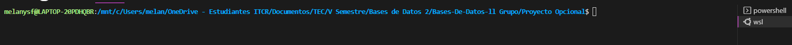

2- Ir a la carpeta "WindyUI" y luego a la carpeta "Docker"  
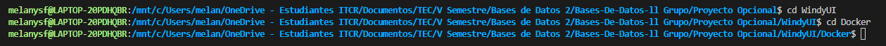

3- Ejecutar el archivo build.sh con el siguiente comando: **bash build.sh**  
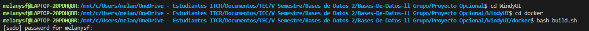

4- En la misma consola WSL, en la carpeta del proyecto ir a la carpeta "WindyUI" y luego a la carpeta "Charts"  
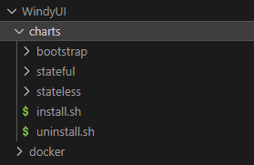

5- Ejecutar el archivo install.sh con el siguiente comando: **bash install.sh**  
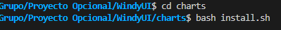

-------------------------------

## **Componentes**

### **Countries/States CronJob**

El countries y states cronjobs consiste en dos componentes de tipo Cronjob que se ejecutan una vez al día.  
Estos estan compuestos por una **caperta app**, ubicada en **WindyUI -> Docker -> CountriesCronjob**, o en caso de states, **StatesCronjob** que contiene:

* **app.py:** Consiste en un achivo python que se encarga de leer el archivo "ghcnd-countries.txt" de la página del NOA, mediante los modulos requests, ademas, se calcula el MD5 del archivo y se crea la conexión con MariaDB, cargando los países a la base de datos de WindyUI.  

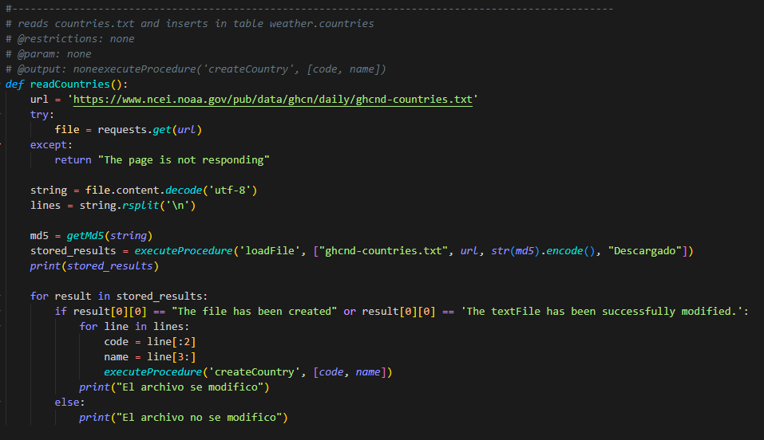

* **requirements.txt:** Archivo que contiene los modulos necesarios para el .py.  

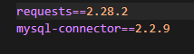

En el countries/states cronjob tambien se encuentra el **dockerfile** necesario para la creación de la imagen que será usada en el los objetos de cronjobs respectivos. 

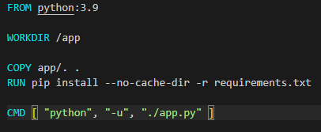

Tambien usan el template **countriesCronjob.yaml** (en caso de countries) o el template **statesCronjob.yaml** (en caso de states), estos estam ubicados en **WindyUI -> charts -> stateless -> template**, cada uno de estos archivos sigue la estructura de un cronjob. 

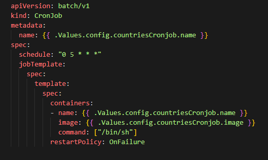

Todo esto se conecta con la base de datos en **MariaDB** mediante el modulo **mysql.connector**, que se encarga de hacer una llamada a la funcion **"executeProcedure"**, que recibe el nombre del procedimiento a utilizar, más los parametros del procedimiento, en forma de lista de strings no con None en caso de tener datos NULL.

### **Station CronJob**

Es similar al anterior, consiste en un componente de tipo Cronjob que se ejecuta una vez al día.  

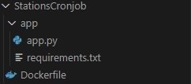

Estos estan compuestos por una **caperta app**, ubicada en **WindyUI -> Docker -> StationCronjob** que contiene:  

* **app.py:** Consiste en un achivo python que se encarga de leer el archivo "ghcnd-stations.txt" de la página del NOA, mediante los modulos requests, ademas, se calcula el MD5 del archivo y se crea la conexión con MariaDB, cargando las estaciones a la base de datos de WindyUI.  

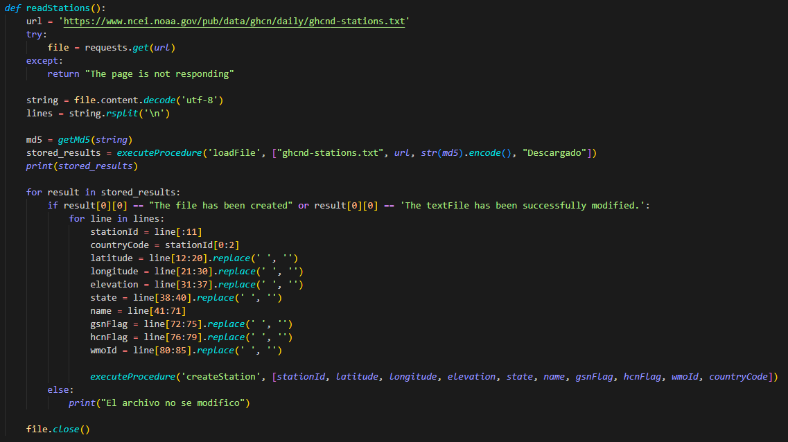

* **requirements.txt:** Archivo que contiene los modulos necesarios para el .py.  

En el countries/states cronjob tambien se encuentra el **dockerfile** necesario para la creación de la imagen que será usada en el los objetos de cronjobs respectivos. 

Tambien usan el template **countriesCronjob.yaml** (en caso de countries) o el template **statesCronjob.yaml** (en caso de states), estos estam ubicados en **WindyUI -> charts -> stateless -> template**, cada uno de estos archivos sigue la estructura de un cronjob.  

De igual forma, se conecta con la base de datos en **MariaDB** mediante el modulo **mysql.connector**, que se encarga de hacer una llamada a la funcion **"executeProcedure"**, que recibe el nombre del procedimiento a utilizar, más los parametros del procedimiento, en forma de lista de strings no con None en caso de tener datos NULL.

### **Orchestrator CronJob**

### **Processor**

### **Parser**

### **Otros**

* **Función excecuteProcedure**: Es una función que se encarga de hacer la conexión con la base de datos en MariaDB. Retorna un arreglo con los resultados que da la base de datos al cargar los datos.  

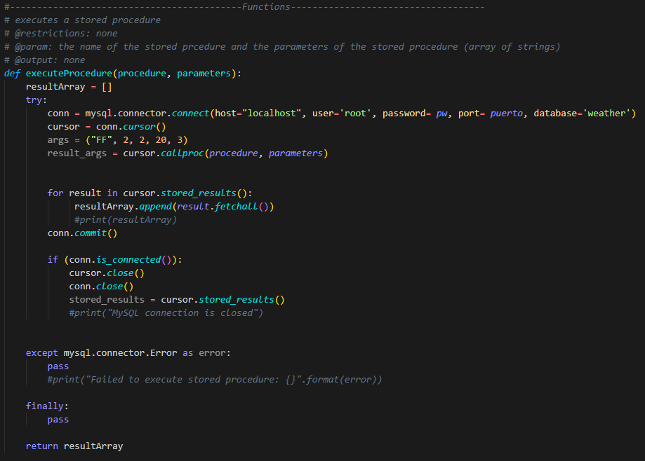

* **Función getMD5**: Esta función se encarga de calcular el md5 de un archivo, este es usado para saber si el archivo ha sido modificado. Recibe un string con lo que contiene el archivo y retorna el calculo del MD5.  

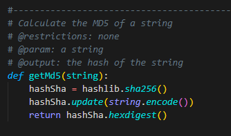

-------------------------------

## **Pruebas**

### **Prueba de Station CronJob**

### **Prueba de Countries/States CronJob**

### **Prueba de Orchestrator CronJob**

### **Pruebo de Processor**

### **Pruebo de Parser**

-------------------------------

## **Resultados de pruebas unitarias**

-------------------------------

## **Recomendaciones**

1- Empezar por lo primero, no apresurarse y empezar con partes del proyecto que estan más avanzadas.  
2- Repartir y asignar tareas a cada integrante del equipo para progresar.  
3- Investigar los conceptos esenciales para desarrollar la solución.  
4- Tener un buen conocimiento de como se utilizan las herramientas necesarias para el desarrollo del proyecto.  
5- Utilizar un buen control de versiones y tener un buen manejo de github.  
6- Tener una buena estructura del proyecto y dividir el proyecto de forma funcional.  
7- Implementar buenas prácticas de programación.  
8- Tener una buena comunicación con el equipo de trabajo.  
9- Realizar pruebas.  
10- Seguir aprendiendo y enriqueciendo el conocimiento después de finalizar el proyecto.  

-------------------------------

## **Conclusiones**

1- La organización es importante para poder llevar a cabo el proyecto.  
2- El trabajo en equipo es esencial para llevar finalizar el proyecto.  
3- El conocimiento de conceptos básicos es sustancial para entender los pasos que hay que realizar al desarrollar el proyecto.  
4- El tener un buen entendimiento del funcionamiento de las herramientas que se van a necesitar facilita el avance del desarrollo de la solución.  
5- El tener un buen control de versiones y saber utilizar github facilita el trabajo en equipo y es una buena práctica.  
6- El tener una buena organización y estructura del proyecto es importante para tener un mayor orden, y por ende, facilitar el trabajo.  
7- El utilizar buenas prácticas de programación asegura que el código sea legible y entendible para continuar su desarrollo en un futuro de forma eficaz.  
8- El tener una buena comunicación tiene como resultado un proyecto de calidad y organizado que avanza progresivamente.  
9- Es importante la realización de pruebas para garantizar el buen funcionamiento del programa.  
10- Para reforzar habilidades y mejorar de forma continua, es importante continuar la investigación de los temas que se estudiaron.  

-------------------------------

## **Referencias Bibliográficas**

(La documentación debe cubrir todos los componentes implementados o instalados/configurados, en caso de que algún componente no se encuentre implementado, no se podrá documentar y tendrá un impacto en la completitud de la documentación.)
