## **Instituto Tecnológico de Costa Rica**

## **IC4302 - Bases de Datos II**

## **Documentación Proyecto 1**

### **Profesor**: Nereo Campos Araya

### **Estudiantes**:

- Fiorella Zelaya Coto - 2021453615
- Isaac Araya Solano - 2018151703
- Melany Salas Fernández - 2021121147
- Moisés Solano Espinoza - 2021144322
- Pablo Arias Navarro - 2021024635

# **Diagrama entidad-relación**

    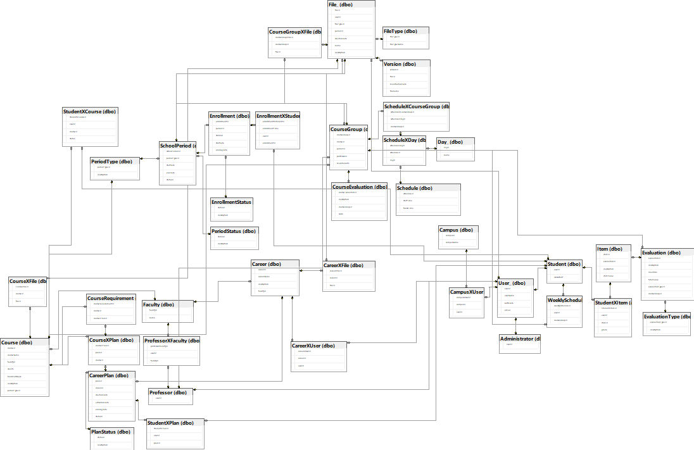

La tabla Student, Professor y User heredan de la tabla User.

Se tiene la tabla Career. Esta entidad tiene relación n:n con User, por lo que existe la tabla CareerXUser, que registra los varios usuarios que pertenecen a varias carreras. Esta tabla también tiene relación n:n con File, por lo que existe la tabla CareerXFile.

Se tiene la tabla CareerPlan, que conecta con Career ya que los planes de estudio pertenecen a una carrera. Esta relacion es N:1. Los planes de carrera tienen un status, por lo que se relacionan con la tabla PlanStatus y su relación es de N:1. La tabla CareerPlan también tiene relación con Student, ya que los estudiantes pueden tener uno o más planes de carrera, si llevan una o más carreras. Esta relación es N:1.

Se tiene la tabla Campus. Esta entidad tiene relación con User, por lo que existe la tabla CampusXUser, que registra los varios usuarios que pertenecen a varios campus. 

Se tiene la tabla File. De esta entidad hereda la tabla Version, la cual registra las diferentes versiones que puede tener un archivo. Esta relación es N:1. La tabla File tiene relación con la tabla User, ya que registra el usuario que subió el archivo. Esta relación es N:1. También tiene relación con la tabla SchoolPeriod ya que registra el periodo en el que se subió el archivo. Esta relación es N:1. La tabla file tiene un FileType que se relaciona con la tabla FileType, esta relación es N:1.  También tiene relación con la tabla Course, ya que los archivos pueden pertenecer a un curso. Esta relación es N:N, por lo que existe la tabla CourseXFile. 

Se tiene la tabla Faculty. Esta entidad tiene relación con Course ya que los cursos pertenecen a una facultad. Esta relación es N:1. También tiene relación con Career, ya que las carreras pueden pertenecer a una facultad. Esta relación es N:1. También tiene relación con Professor, ya que los profesores pueden pertenecer a una facultad. Esta relación es N:N, por lo que existe la tabla ProfessorXFaculty.

Se tiene la tabla SchoolPeriod. Esta entidad tiene relación con PeriodType ya que los periodos tienen un tipo de periodo como Semestre o Cuatrimestre. Esta relación es N:1.También tiene relación con PeriodStatus ya que los periodos tienen un estado como En curso o Finalizado. Esta relación es N:1. 

Se tiene la tabla Course. Esta entidad tiene relación con Faculty ya que los cursos pertenecen a una facultad. Esta relación es N:1. También tiene relación con PeriodType ya que los cursos tienen un tipo de periodo como Semestre o Cuatrimestre. Esta relación es N:1. También tiene relación con CareerPlan ya que los cursos pertenecen a un plan de carrera. Esta relación es N:N, por lo que existe la tabla CourseXPlan. También tiene relación con CourseRequirement ya que los cursos pueden tener requisitos. Esta relación es N:1. También tiene relación con Student, ya que los estudiantes pueden llevar uno o más cursos. Esta relación es N:N, por lo que existe la tabla StudentXCourse.

La tabla CourseRequirement tiene relación con CourseXPlan ya que los requisitos de los cursos pertenecen a un plan de carrera. Esta relación es N:1.

Se tiene la tabla Enrollment. Esta entidad tiene relación con Student ya que los estudiantes pueden participar en muchas matriculas. Esta relación es N:N, por lo que existe la tabla StudentXEnrollment. También tiene relación con SchoolPeriod ya que las matriculas pertenecen a un periodo. Esta relación es N:1. También tiene relación con EnrollmentStatus ya que las matriculas tienen un estado como Abierta o Cerrada. Esta relación es N:1.

Se tiene la tabla WeeklySchedule que representa una tabla StudentXCourseGroup. Esta entidad representa los cursos que han sido matriculados por el estudiante.

Se tiene la tabla CourseGroup. Esta entidad tiene relación con Course ya que los grupos de cursos pertenecen a un curso. Esta relación es N:1. También tiene relación con Professor ya que los grupos de cursos pertenecen a un profesor. Esta relación es N:1. También tiene relación con SchoolPeriod ya que los grupos de cursos pertenecen a un periodo. Esta relación es N:1. También tiene relación con la tabla GroupXFile ya que los grupos de cursos pueden tener archivos. Esta relación es N:N.

Se tiene la tabla Schedule. Esta entidad tiene relación con CourseGroup ya que los horarios pertenecen a un grupo de cursos. Esta relación es N:N por lo que existe la tabla GroupXSchedule. 

La entidad Schedule también tiene relación con la tabla Day, ya que los horarios tienen uno o vario días. Esta relación es N:N, por lo que existe la tabla ScheduleXDay.

Se tiene la tabla CourseEvaluation que representa la evaluación anónima de los estudiante de un grupo/profesor. Esta entidad tiene relación con CourseGroup ya que las evaluaciones pertenecen a un grupo de cursos. Esta relación es N:1.

Se tiene la tabla Evaluation. Esta entidad tiene relación con Item, ya que las evaluaciones tienen uno o más items. Esta relación es N:1. También tiene relación con EvaluationType ya que las evaluaciones tienen un tipo como Examen o Tarea. Esta relación es N:1.

La tabla Item tiene relación con Student ya que los items tienen la calificación de los estudiantes de dicho rubro. Esta relación es N:N, por lo que existe la tabla StudentXItem.

## **Procedures**

- **spCreateFile**  
Crea un archivo nuevo y lo inserta en la tabla File y Version.  
*Parámetros*: id del usuario, nombre del archivo, id del tipo de archivo, id del periodo lectivo, nombre unico del archivo (generado) y descripción del archivo.  
*Retorna*: hace un select de un mensaje de error si es que hay alguno, de lo contrario no retorna nada.  

- **spCreateUser_**  
Crea un usuario nuevo y lo inserta en la tabla User_.  
*Parámetros*: id del usuario, nombre de usuario, fecha de cumpleaños, correo, id del campus, es estudiente o no (1 o 0).  
*Retorna*: hace un select de un mensaje de error si es que hay alguno, de lo contrario no retorna nada.  

- **spDeleteFile**  
Elimina un archivo de la tabla File y Version. Si el archivo tiene más de una versión, solo elimina la versión actual, de lo contrario elimina el archivo y todas sus versiones.  
*Parámetros*: nombre único del archivo. 
*Retorna*: hace un select de un mensaje de error si es que hay alguno, de lo contrario no retorna nada. 

- **spDeleteUser_** 
Elimina un usuario de la tabla User_. 
*Parámetros*: id del usuario. 
*Retorna*: hace un select de un mensaje de error si es que hay alguno, de lo contrario no retorna nada. 

- **spEnrollment** 
Crea una matrícula nueva y la inserta en la tabla EnrollmentXStudent y WeeklySchedule. Realiza todas las validaciones que permitan o no la creación de la matrícula. 
*Parámetros*: id del usuario, id del grupo del curso a matricular. 
*Retorna*: hace un select de un mensaje de error si es que hay alguno, de lo contrario no retorna nada. 
*Validaciones*: parámetros null y existencia de todas las llaves foráneas, que el estudiante cumpla con todos los réquisitos del curso para matricular __ 
(spMeetRequirements)__, que el usuario no tenga un choque de horarios con los cursos que ya está matriculado y que no haya matriculado el curso en otro grupo.  

- **spEnrollmentTimeSchedule** 
Calcula el horario de la matrícula (hora) de un estudiante con base en el período del último período lectivo cursado. 
*Parámetros*: id del usuario, id del período lectivo. 
*Retorna*: hace un select de un mensaje de error si es que hay alguno, de lo contrario, retorna el horario de la matrícula. 

- **spExistsFile** 
Verifica si un archivo existe en la tabla File. 
*Parámetros*: nombre del archivo. 
*Retorna*: hace un select de un mensaje de error si es que hay alguno, de lo contrario, hace un select de un mensaje de que el archivo existe. 

- **spGetAllVersionsOfFile** 
Obtiene todas las versiones de un archivo. 
*Parámetros*: id del archivo. 
*Retorna*: hace un select de un mensaje de error si es que hay alguno, de lo contrario, hace un select de todas las versiones del archivo. 

- **spGetCourses** 
Obtiene todos los cursos de un estudiante que puede matricular en este periodo lectivo con base en los que ya ha llevado y aprobado.v
*Parámetros*: id del usuario. 
*Retorna*: hace un select de un mensaje de error si es que hay alguno, de lo contrario, hace un select de todos los cursos que puede matricular el estudiante. 

- **spGetEnrolledCourses** 
Obtiene todos los cursos matriculados de un estudiante del último periodo lectivo. 
*Parámetros*: id del usuario. 
*Retorna*: hace un select de un mensaje de error si es que hay alguno, de lo contrario, hace un select de todos los cursos matriculados del estudiante. 

- **spGetEnrollmentTime** 
Obtiene el horario de matrícula (hora y fecha) de un estudiante con base en el período del último período lectivo cursado. 
*Parámetros*: id del usuario. 
*Retorna*: hace un select de un mensaje de error si es que hay alguno, de lo contrario, hace un select del horario de la matrícula. 

- **spGetFileNameFromVersion** 
Obtiene el nombre único del archivo de una versión con base en el nombre original del archivo y la versión. 
*Parámetros*: nombre original del archivo, versión del archivo. 
*Retorna*: hace un select de un mensaje de error si es que hay alguno, de lo contrario, hace un select del nombre único del archivo. 

- **spGetFileVersions** 
Obtiene todas las versiones de un archivo. 
*Parámetros*: nombre único del archivo. 
*Retorna*: hace un select de un mensaje de error si es que hay alguno, de lo contrario, hace un select de todas las versiones del archivo. 

- **spGetGradeAverage** 
Obtiene el promedio de notas de un estudiante de un curso. 
*Parámetros*: id del usuario, id del curso. 
*Retorna*: hace un select de un mensaje de error si es que hay alguno, de lo contrario, hace un select del promedio de notas del estudiante. 

- **spGetGradeOfCourse** 
Obtiene la nota de un estudiante de un curso. 
*Parámetros*: id del usuario, id del curso. 
*Retorna*: hace un select de un mensaje de error si es que hay alguno, de lo contrario, hace un select de la nota del estudiante. 

- **spGetLastPlan** 
Obtiene el último plan de un estudiante. 
*Parámetros*: id del usuario, id de la carrera. 
*Retorna*: hace un select de un mensaje de error si es que hay alguno, de lo contrario, hace un select del último plan del estudiante. 

- **spGetLatestFileVersion** 
Obtiene la última versión de un archivo. 
*Parámetros*: id del usuario, nombre del archivo. 
*Retorna*: hace un select de un mensaje de error si es que hay alguno, de lo contrario, hace un select de la última versión del archivo. 

- **spGetVersionOfFile** 
Obtiene el nombre único de un archivo con base en la version. 
*Parámetros*: id del usuario, id del archivo, versión del archivo. 
*Retorna*: hace un select de un mensaje de error si es que hay alguno, de lo contrario, hace un select del nombre único del archivo. 

- **spInsertEnrollmentXStudent** 
Inserta una matrícula nueva en la tabla EnrollmentXStudent. 
*Parámetros*: id de la matricula abierta, id del período lectivo de la matrícula, id del usuario, hora en la que se realizó la matrícula. 
*Retorna*: hace un select de un mensaje de error si es que hay alguno, de lo contrario no retorna nada. 

- **spMeetRequirements** 
Verifica si un estudiante cumple con todos los réquisitos de un curso para matricular. 
*Parámetros*: id del usuario, id del curso a matricular. 
*Retorna*: hace un select de un mensaje de error si es que hay alguno, de lo contrario, retorna si el estudiante cumple con todos los réquisitos del curso (1 o 0). 

- **spModifyFile** 
Agrega una nueva version del archivo a la tabla Version. 
*Parámetros*: id del usuario, nombre original del archivo, nombre único del archivo. 
*Retorna*: hace un select de un mensaje de error si es que hay alguno, de lo contrario no retorna nada. 

- **spReadFile** 
Obtiene todos los archivos de la tabla File. 
*Parámetros*: ninguno. 
*Retorna*: hace un select de todos los archivos en la tabla File. 

- **spReadSchoolPeriod** 
Obtiene la info del período lectivo. 
*Parámetros*: id del período lectivo. 
*Retorna*: hace un select de un mensaje de error si es que hay alguno, de lo contrario, hace un select de la info del período lectivo. 

- **spReadUser_** 
Obtiene la info del usuario. 
*Parámetros*: id del usuario. 
*Retorna*: hace un select de un mensaje de error si es que hay alguno, de lo contrario, hace un select de la info del usuario. 

- **spUnregister** 
Elimina una matrícula de la tabla WeeklySchedule, y si el usuario desmatricula todos los cursos, elimina la matrícula del usuario en la tabla EnrollmentXStudent. 
*Parámetros*: id del usuario, id del grupo del curso. 
*Retorna*: hace un select de un mensaje de error si es que hay alguno, de lo hace un select del mensaje que indica que se matriculó el estudiante. 

# **Enlace a proyecto Thunkable**

[Proyecto Thunkable](https://x.thunkable.com/copy/41a90159e95f29d6a3fa2bd8f1334243)

# **Instrucciones de ejecución**

## **Aplicacion en ReactJs**

Primeramente, debemos de abrir una terminal y asegurarnos de que nos encontramos en el directorio con nombre “eduhub-filemanager”, en caso de no ser así debemos de dirigirnos a este.

Una vez hecho lo anterior, debemos de ejecutar el comando “npm install”, el cual básicamente lo que hace es instalar todas las dependencias y módulos que se encuentran en el archivo "package.json" del proyecto y  creará una carpeta llamada "node_modules" en la raíz del proyecto, donde se almacenarán los archivos de los módulos instalados. (Esto es necesario para ejecutar el proyecto)

Posterior a esto, lo que debemos de hacer es ejecutar o iniciar el servicio, por lo que utilizamos el comando “npm run start”, con el cual ya empieza a correr el servicio y podemos entrar a la app con la dirección que se nos brinda en consola, la cual por defecto es “localhost:3000” en caso de que no se esté utilizando ese puerto.

**Nota:** Es importante recalcar que el “npm” puede ser sustituido por “Yarn”, esto dependerá de cual administrador de paquetes de Node js tengamos instalado en nuestra computadora.

---
1- Abrir el link en el navegador de preferencia.

    

2- Ingresar los credenciales del usuario.

    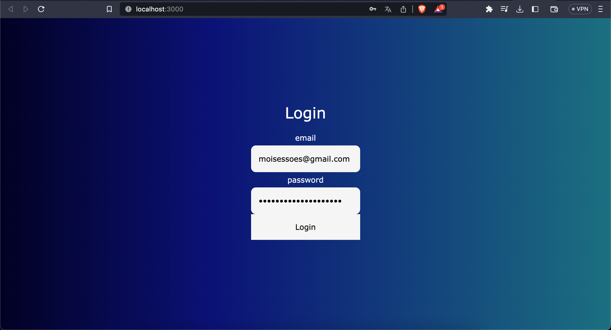

3- Dar al boton de Login.

    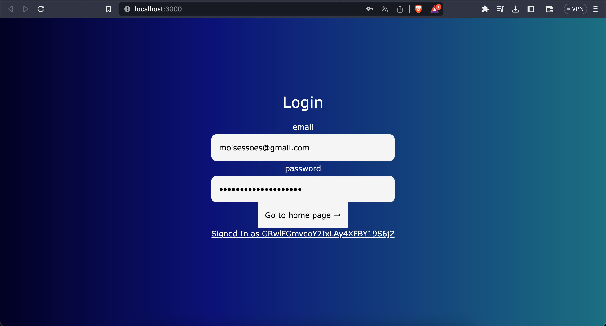

4- Dar al botón de "Go to home page", se redireccionará a la pantalla de home.

    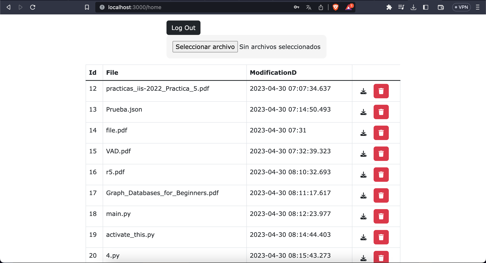

5- Aquí se selecciona el botón con la opción que se desee.

6- Si se quiere subir un archivo, se presio el botón de Seleccionar archivo, se selecciona el archivo y se presiona el botón de subir archivo.

    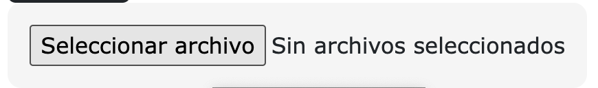

7- Si se desea descargar un archivo, se presiona el botón de download y se acepta el mensaje. Luego se tiene que seleccionar el lugar de la computadora donde se desea descargar el archivo.

    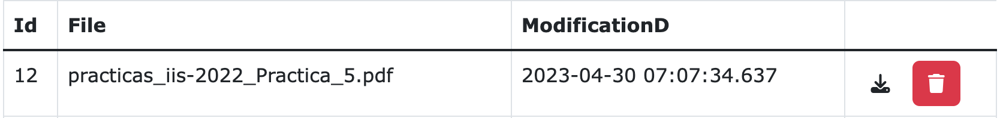

    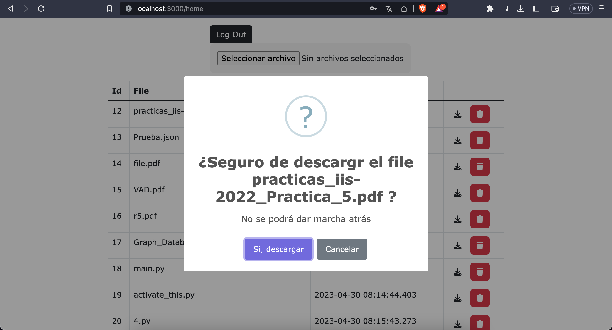

8- Si se desea eliminar un archivo, se presiona el botón de delete y se acepta el mensaje. Con esto ya estará eliminado del Blob Storage.

    

    

9- Para finalizar, cuando el usuario ya no desee estar en la aplicación, se presiona el botón de logout y se redireccionará a la pantalla de login.

    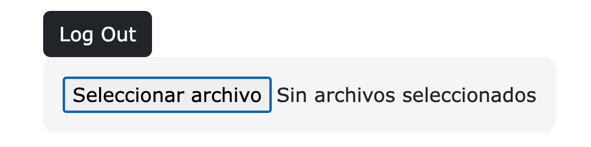

    

## Intrucciones de proyecto de thunkable

1- Abrir el navegador de preferencia.

2- Buscar [Thukable](https://thunkable.com/#/)

3- Iniciar sesión o crearse una cuenta

4- Abrir el link [Proyecto Thunkable](https://x.thunkable.com/copy/41a90159e95f29d6a3fa2bd8f1334243)

5- Ejecutar desde web preview, desde la ventana **logInScreen**

    

6- Utilizar la app

**Nota:** Se recomienda ingresar con el usuario **sarah.lee@example.com**, password sarah.lee@example.com, debido a que es el que más datos para pruebas tiene. Si crea un nuevo usuario no podrá matricular porque no tiene asigados periodos de matricula, carrera...

# **Pruebas realizadas**

## Pruebas de Thunkable

[Prueba 1 Thunkable](https://youtu.be/Z0nLTqFeTK4)

[Prueba 2 Thunkable](https://youtu.be/AZp8zoKrgHg)

# **Resultados de pruebas unitarias**
## **API**
Este API fue sometido a pruebas unitarias de cada uno de los endpoints, dando como resultado un éxito en las 18 pruebas. 

    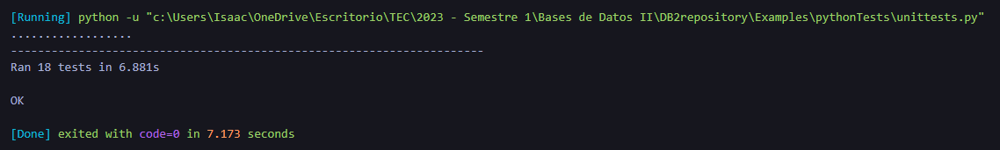

Cada una de las 18 pruebas es una conexión a cada uno de los distintos endpoints. 

# **Componentes**

## **API**
El API es utilizado para habilitar los distintos endpoints http para las distintas funcionalidades de las aplicaciones tanto de Thunkable como NodeJS. Existen 18 endpoints distintos, cada uno con su respectiva funcionalidad. A continuación, se listan cada uno de los endpoints y se explica su utilidad:

### **Main Endpoint**
Método HTTP: GET

https://main-app.ambitiousdune-6b5fa4be.eastus.azurecontainerapps.io/

Este endpoint simplemente da un mensaje de bienvenida al API y confirma la conexión con el mismo. 

### **Login Endpoint**
Método HTTP: POST

https://main-app.ambitiousdune-6b5fa4be.eastus.azurecontainerapps.io/login/<string:userId>

Este endpoint se encarga de enviar a Cassandra el registro de que un usuario ha iniciado sesión en la aplicación.

### **Logout Endpoint**
Método HTTP: POST

https://main-app.ambitiousdune-6b5fa4be.eastus.azurecontainerapps.io/logout/<string:userId>

Este endpoint se encarga de enviar a Cassandra el registro de que un usuario ha cerrado sesión en la aplicación.

### **File Information Endpoint**
Método HTTP: GET

https://main-app.ambitiousdune-6b5fa4be.eastus.azurecontainerapps.io/file/list

Este endpoint se encarga de devolver la información de los archivos almacenados en la base junto con cada una de las versiones. Se utiliza para mostrar el listado de archivos en la aplicación de NodeJs.

### **Blob Upload Endpoint**
Método HTTP: POST

https://main-app.ambitiousdune-6b5fa4be.eastus.azurecontainerapps.io/blobstorage/upload/<string:userId>

Este endpoint se encarga de subir un archivo al Blob Storage y la información del mismo a la base de datos. Para poder utilizarlo, aparte de hacer una consulta de tipo post al endpoint con el respectivo usuario, se debe de agregar el archivo a subir en el "body" de la consulta, especificamente en el "formdata" con el nombre "file". 

### **Blob Download Endpoint**
Método HTTP: GET

https://main-app.ambitiousdune-6b5fa4be.eastus.azurecontainerapps.io/blobstorage/download/<string:userId>/<string:filename>/<string:version>

Este endpoint se encarga de permitir la descarga de los archivos almacenados en el Blob Storage. Para realizar la descarga se debe de incluir el usuario, el nombre del archivo y la versión del mismo que se desea descargar.

### **Blob Delete Endpoint**
Método HTTP: DELETE

https://main-app.ambitiousdune-6b5fa4be.eastus.azurecontainerapps.io/blobstorage/delete/<string:userId>/<string:filename>/<string:version>

Este endpoint se encarga de eliminar los archivos almacenados en el Blob Storage y su información de la base. Para poder eliminar un archivo se debe de incluir el usuario, el nombre del archivo y la versión del mismo que se desea eliminar.

### **User Information Endpoint**
Método HTTP: GET

https://main-app.ambitiousdune-6b5fa4be.eastus.azurecontainerapps.io/user/info/<string:userId>

Este endpoint se encarga de obtener la información de un respectivo usuario en la base de datos.

### **User Creation Endpoint**
Método HTTP: POST

https://main-app.ambitiousdune-6b5fa4be.eastus.azurecontainerapps.io/user/create/<string:userId>/<string:userName>/<string:userBirthDay>/<string:userEmail>/<string:idCampus>/<string:isStudent>

Este endpoint se encarga de crear un usuario en la base de datos y agregar toda su información.

### **User Update Endpoint**
Método HTTP: PUT

https://main-app.ambitiousdune-6b5fa4be.eastus.azurecontainerapps.io/user/update/<string:userId>/<string:userName>/<string:userBirthDay>/<string:userEmail>/<string:idCampus>

Este endpoint se encarga de actualizar un usuario en la base de datos y toda su información.

### **User Delete Endpoint**
Método HTTP: DELETE

https://main-app.ambitiousdune-6b5fa4be.eastus.azurecontainerapps.io/user/delete/<string:userId>

Este endpoint se encarga de eliminar un usuario en la base de datos y toda su información.

### **Campus List Endpoint**
Método HTTP: GET

https://main-app.ambitiousdune-6b5fa4be.eastus.azurecontainerapps.io/campus/list

Este endpoint se encarga de obtener la lista de campus de la base de datos y toda su 
información. 

### **Courses to Enroll Endpoint**
Método HTTP: GET

https://main-app.ambitiousdune-6b5fa4be.eastus.azurecontainerapps.io/course/<string:userId>

Este endpoint se encarga de obtener la lista de cursos que un usuario tiene disponible para matricular y la información de los mismos. 

### **School Period Information Endpoint**
Método HTTP: GET

https://main-app.ambitiousdune-6b5fa4be.eastus.azurecontainerapps.io/schoolperiod/info/<string:SchoolPeriodId>

Este endpoint se encarga de obtener la información de un periodo. 

### **Enrollment Endpoint**
Método HTTP: POST

https://main-app.ambitiousdune-6b5fa4be.eastus.azurecontainerapps.io/enrollment/enroll/<string:userId>/<string:courseGroupId>

Este endpoint se encarga matricular a un usuario en un curso.

### **Unenrollment Endpoint**
Método HTTP: POST

https://main-app.ambitiousdune-6b5fa4be.eastus.azurecontainerapps.io/enrollment/enroll/<string:userId>/<string:courseGroupId>

Este endpoint se encarga de desmatricular a un usuario de un curso.

### **Enrollment Time Endpoint**
Método HTTP: GET

https://main-app.ambitiousdune-6b5fa4be.eastus.azurecontainerapps.io/enrollment/time/<string:userId>

Este endpoint se encarga de obtener la hora de matricula de un usuario. 

### **Enrolled Courses Endpoint**
Método HTTP: GET

https://main-app.ambitiousdune-6b5fa4be.eastus.azurecontainerapps.io/enrollment/enrolledCourses/<string:userId>

Este endpoint se encarga de obtener la lista de cursos que tiene matriculado un usuario en este periodo. 

---

Por otro lado, además de los endpoints, el API necesitó una serie de funciones para implementar sus funcionalidades. Entre ellas están:
- **random_string(n):** recibe el largo de una cantidad de caracteres y genera un string del tamaño solicitado con caracteres aleatorios para ser utilizados para almacenar las distintas versiones del archivo. 

- **getExtension(word):** esta función recibe un nombre de un archivo y extrae su extensión.

- **getFileNameFromVersion(fileId, version):** Este método recibe un nombre de archivo y una version y devuelve el nombre del archivo en caracteres aleatorios para ser descargado desde el blob storage.

- **uploadFileSQL(userId, filename, fileType, periodId, name):** Esta función se conecta a la base de datos SQL y sube la información del archivo que recibe por parámetros. 

- **deleteFile(name):** Esta función se encarga de borrar la información de un archivo de la base de datos sql a partir del nombre.

- **updateFileSQL(userId, name, fileName):** Esta función se encarga de subir las distintas versiones del un archivo.

---

Finalmente, se creó una clase llamada CassandraConnector que tiene distintos métodos. A continuación se listan sus métodos y se explica su funcionalidad:

- **submit(self, user, log):** Este método toma el ID del usuario y un registro de actividad y los inserta en la tabla "userlogs" en la base de datos Cassandra. Devuelve un mensaje de confirmación.

- **deleteAll(self):** Este método vacía la tabla "userlogs" en la base de datos Cassandra. Devuelve un mensaje de confirmación.

- **uploadFile(self, user):** Este método utiliza el método submit() para registrar en la base de datos que el usuario ha cargado un archivo.

- **downloadFile(self, user):** Este método utiliza el método submit() para registrar en la base de datos que el usuario ha descargado un archivo.

- **modifyFile(self, user):** Este método utiliza el método submit() para registrar en la base de datos que el usuario ha modificado un archivo.

- **deleteFile(self, user):** Este método utiliza el método submit() para registrar en la base de datos que el usuario ha eliminado un archivo.

- **userInfoRequested(self, user):** Este método utiliza el método submit() para registrar en la base de datos que el usuario ha solicitado su información.

- **userInfoUpdated(self, user):** Este método utiliza el método submit() para registrar en la base de datos que el usuario ha actualizado su información.

- **userDeleted(self, user):** Este método utiliza el método submit() para registrar en la base de datos que el usuario ha eliminado su cuenta.

- **signUp(self, user):** Este método utiliza el método submit() para registrar en la base de datos que el usuario se ha registrado.

- **userLogin(self, user):** Este método utiliza el método submit() para registrar en la base de datos que el usuario ha iniciado sesión.

- **userLogout(self, user):** Este método utiliza el método submit() para registrar en la base de datos que el usuario ha cerrado sesión.

- **enrollCourse(self, user):** Este método utiliza el método submit() para registrar en la base de datos que el usuario se ha matriculado en un curso.

- **unenrollCourse(self, user):** Este método utiliza el método submit() para registrar en la base de datos que el usuario se ha desmatriculado de un curso.

- **availableCourses(self, user):** Este método utiliza el método submit() para registrar en la base de datos que el usuario ha visto los cursos disponibles.

- **viewEnrollmentDates(self, user):** Este método utiliza el método submit() para registrar en la base de datos que el usuario ha visto las fechas de matrícula.

- **resetPassword(self, user):** Este método utiliza el método submit() para registrar en la base de datos que el usuario ha restablecido su contraseña.

- **viewGradeAverage(self, user):** Este método utiliza el método submit() para registrar en la base de datos que el usuario ha visto su promedio de calificaciones.

- **getEnrollmentReport(self, user):** Este método utiliza el método submit() para registrar en la base de datos que el usuario ha visto el informe de matriculación.

- **viewEnrolledCourses(self, user):** Este método utiliza el método submit() para registrar en la base de datos que el usuario ha visto los cursos en los que está matriculado.

## **Firebase**

Firebase se utiliza para la autenticación de los usuarios que se crean desde el proyecto Thunkable, se hace mediante correo electrónico y password.

    

### **Configuración de firebase**

Para su cinfiguración, se creó un nuevo proyecto de firebase.

    

Para conectarse a Firebase se debe crear una app web en el siguiente botón:

    

En el proceso de registro de la app se debe colocar un nombre y así se obtendra lo siguiente:

    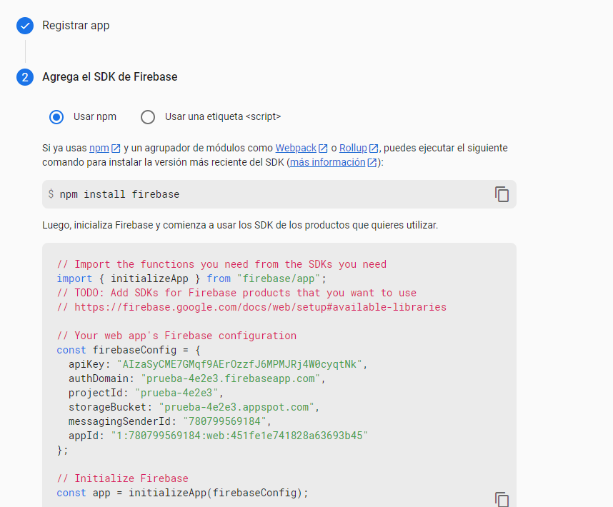

Posteriormente, ya se podrán agregar las demás funcionalidades de Firebase, como autenticación

    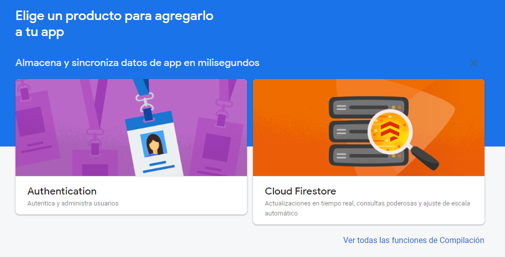

Para configuran autenticación de puede ingresar a la parte de Authentication y seleccionar el botón comenzar y aquí se podra seleccionar un método de autenticación y al selecciona, se debe habilidad correo y contraseña y guardar la configuración.

    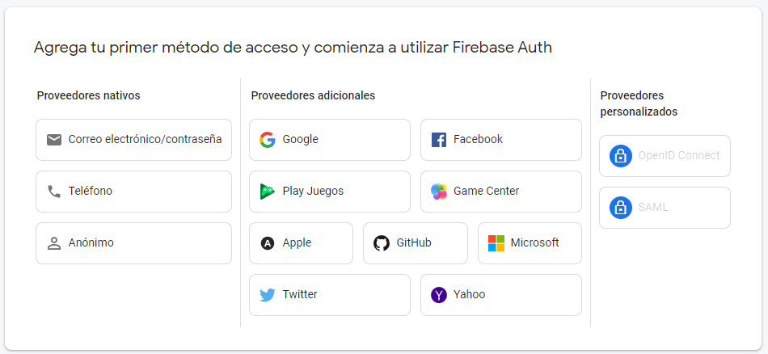

Es así como se configuró firebase para nuestro proyecto. Sin embargo, firebase tiene otras funcionalidades que pueden ser agregadas facilmente, como **Real Time Database**.

    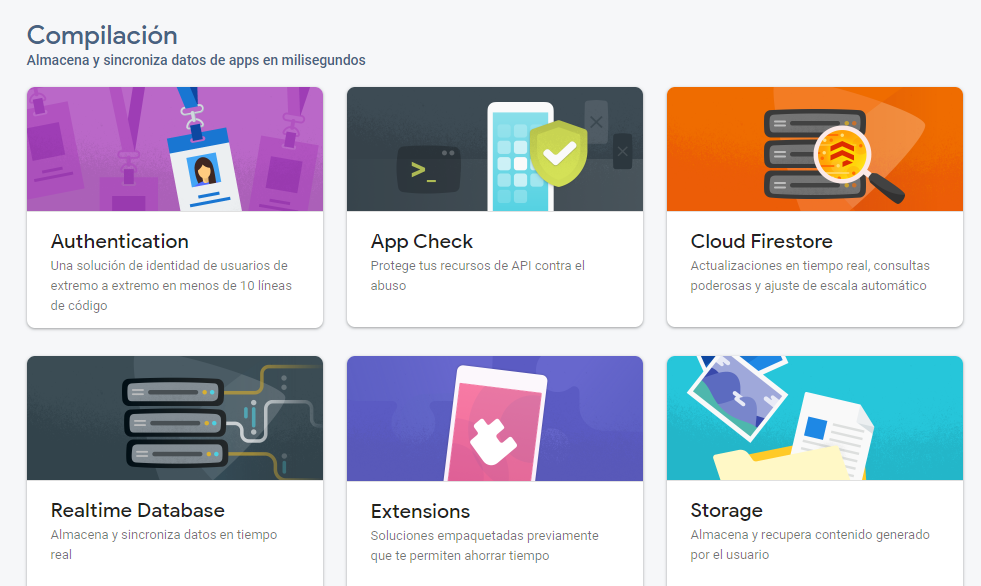

## **NodeJS React**

Antes de empezar a describir y explicar cada una de las partes del proyecto realizado, nos parece relevante mencionar que para el apartado de la App en Node Js que utilizamos el framework de React para hacer todo lo que sería el frontend de la aplicación. 

Además, también podemos mencionar que las principales dependencias que se utilizan en el proyecto son: axios (la cual la utilizamos para realizar las diferentes solicitudes HTTP al API como GET, POST, PUT, DELETE), firebase (la cual es utilizada principalmente para autenticar a los usuarios en la app) y react-router-dom (utilizada para definir rutas y el enrutamiento de la aplicación).

Con respecto al código, podemos notar lo siguiente:
* **Login.jsx:**
En este documento lo que se hace es básicamente el método para la autenticación de los datos ingresados por el usuario con el fin de verificar que estos sean válidos, en relación con los datos que se encuentran almacenados en Firebase. Además, también devolvemos el contenido HTML de este apartado para mostrarlos.

* **Login.css** (Todos los .css o .scss tienen un comportamiento similar): 
Este lo utilizamos para definir estilos y diseños personalizados para los elementos HTML retornados en el return del método del Login.jsx que se mencionó anteriormente. Permitiéndonos, personalizar el aspecto y la presentación de la página en este apartado. 

* **Firebase.js:**
Utilizado para recuperar y definir la información necesaria para la autenticación del usuario en la aplicación (Recupera la información directamente de la base que utilizamos de Firebase).

* **App.js:**  
Este define la estructura de la aplicación y los componentes que se van a mostrar en la página web. Se podría decir, que es el primer punto de contacto para la construcción de cualquier nuestra aplicación.

* **Index.js:**
Este se utiliza como punto de entrada principal de la aplicación. Básicamente, se encarga de renderizar el componente principal de la aplicación en el navegador web.

* **Functions.js:** 
Esta se utiliza como complemento del documento llamado “ShowFiles.js”, básicamente se utiliza para mostrar alertas en caso de que ocurra el evento especificado en el código.

* **ShowFiles.js:**
Este básicamente se utiliza como el “file manager” en sí, pues es donde implementamos todas las herramientas relacionadas a este (upload, download, deleted). En este se utiliza la autenticación de Firebase para obtener el UID del usuario que se encuentra en la sesión actualmente. Se utiliza una función diferente para cada funcionalidad del “file manager” en la que se utiliza la librería “axios” para manejar los diferentes request que se le realizan al API de Azure. Con respecto, al html o view, en la parte superior se maneja un botón para hacer logout y uno para enviar un archivo al API. En la parte de la tabla, se crea un row para cada file del Blob Storage con su versión respectiva y a la derecha de estos se encuentran los botones de “Descarga” y “Eliminar” que afectan al archivo que se encuentra en ese mismo row.

##  **Referencias de React:**

Bezkoder (2021). Vue File Upload example using Axios. https://www.bezkoder.com/vue-axios-file-upload/

Borja95. (2023). Crudapirestsencillo. GitHub. https://github.com/Borja95/crudapirestsencillo

Coding Shiksha (2023). How to Download Files and Images From Inernet Using Axios in Javascript. Youtube. https://www.youtube.com/watch?v=-qWzSl_h8kI

DannCruise (2023). Products-react-pro. GitHub. https://github.com/DannCruise/products-react-pro

Ijaz, U (2023). How to upload files in React app using Axios?. https://rapidapi.com/guides/upload-files-react-axios

Programando con Dan Cruise (2023). CRUD en React consumiendo una API. Youtube. https://www.youtube.com/watch?v=fgQHjMotDPk&t=840s

Programming With Prem (2023). File Upload with progress bar in React JS and axios. Youtube. https://www.youtube.com/watch?v=Ti8QNiRRzOA

satansdeer (2023). React-firebase-auth. GitHub. https://github.com/satansdeer/react-firebase-auth

WebDev Pills (2023). [ REACT JS ] File Upload. Youtube. https://www.youtube.com/watch?v=3pQY--GR2sI&t=642s

## **Thunkable**
### ***Conexión de Thunkable y firebase**

En la sección de settings en Thunkable se colocó el url del API Key de Firebase y el URL de la base de datos en tiepo real, tambien de firebase, sin embargo, firebase no se usa para almacenamiento de datos, solo se usa para la autenticación.

    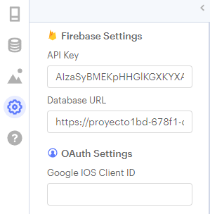

Cuando se crea un nuevo usuario se agrega su correo y password a firebase y se le crea un userID.

    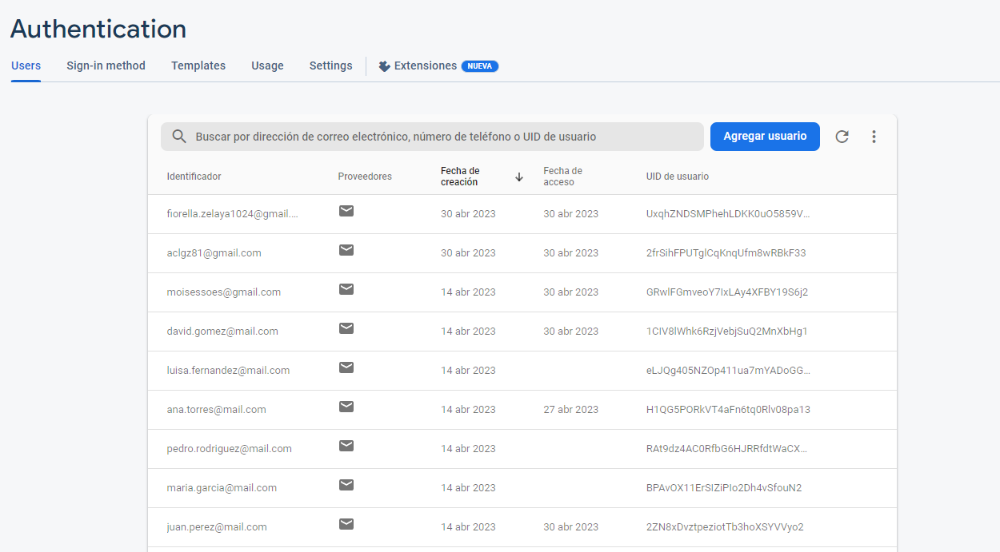

### **Log In Screen**

En la pantalla  de inicio de sesión el usuario debe ingresar el email y el password que se encuentra reguistrado en firebase.

    

    

Se hace uso de la función **firebase sign in** de thunkable, haciendo uso del email y el password ingresado por el usuario mediante text inputs, firebase retorna error en caso de que alguno de los datos este incorrecto y se hace el despliegue de una alerta al usuario, donde se coloca el mesaje de error.

Hce uso de variables stored para guardar el userid, email y password en caso de que necesiten usarse en otras partes de la applicación.

Cuando la ventaja se va a cerrar para dirigirse al homeScreen, se "limpian" los campos y se abre la nueva ventana.

    

La función para llamar alertas recibe el mensaje y le muestra lo sigiente al usuario:

    

El mensaje va a variar de acuerdo al error.

    

También, el resto de botones tienen otros bloques de código para registrarse a la app o hacer la recupeción de la contraseña.

### **Sign In Screen**

Aquí el usario puede registrase a la app para ingresar a hacer la matricula, debido a que solo se implementa la parte de matricula, se asume que todos los usarios son estudiantes

    

Aquí se definen las variables de app actualDate donde se coloca  la fecha actual, este se usa para las validaciones de la fecha de cumpleaños. Tambien se define userData_json para almacenar los datos que ingresa el usuario y enviarlos al api.

    

Cuando la ventana se abre se inicializan ciertos valores, el if verifica si es un nuevo usuario ingresando o solo cambio de ventana para cambiar el campus. Si solo cambio de ventana para lo del campus, no se cambia la fecha actual (la toma del date picker) y se cambia el texto de la label, si es un nuevo usuario, se hace el get date y se incializan otros valores.

    

Cuando la ventana se abre se inicializan ciertos valores, el if verifica si es un nuevo usuario ingresando o solo cambio de ventana para cambiar el campus. Si solo cambio de ventana para lo del campus, no se cambia la fecha actual (la toma del date picker) y se cambia el texto de la label, si es un nuevo usuario, se hace el get date y se incializan otros valores.

    

Cuando se selecciona una fecha de nacimiento se usa la variable que se inicializa al abrir la ventana, la de la fecha actual, se hace la verificación de si esta es menor o igual a la seleccionada, si se cumple la condición se llama a la función para un mensaje de error, notificando que la fecha es inválida porque es después de la fecha actual, además, el texto se coloca de color rojo para hacerle saber al usuario que esta mal. En caso contrario, se pone la fecha en color negro.

    

Por otro lado, cuando el usuario presiona el botón de  se hacen las distintas verificaciones de datos, entre ellas:

* Los password son iguales
* El campo del nombre esta lleno
* La fecha esta bien
* El campus ha sigo seleccionado

    

Demás verificaciones se hacen al llamar sign up de firebase, debido a que esta nos da verifiaciones de email.

    

La funcion que hace el sign Up también llama a la función **saveInfo**, que hace el firebase sign in con el input del email y el password, posteriormente llama a la función de connectApi con el url con el que se va a llamar al API.

    

En connectAPI se hace el set el http al que nos vamos a conectar para mandar los datos del usuario. Su usa la función **call API azure** y se hace un post, cuando se crea el usuario se le muestra un mensaje al usuario indicandole que su usuario se creo con éxito'.

    

Tambien tiene otras opciones para cambiar entre ventanas

    

En varias secciones se llama a la función **resetScreen** para que los datos regresen a los datos iniciales.

    

### **Home Screen**

    

Esta es la ventana principal y la que hace que el estudiante vea las distintas funcionalidades para la matricula. Cuando se abre, toma la hora de matricula más reciente del estudiante, esta será usada después.

    

Esto se hace con un llamado al api y parseando el JSON de la respuesta.

    

Al presionar log out, primero se preguntará por confirmación por parte del usuario y posteriormente, si confirma que quiere salirse, se procede a llamar a la función sign out de firebase y regresa a la ventana principal.

    

### **Enroll Screen**

En esta ventana el estudiante puede matricular los cursos de interés, en esta, los cursos "matriculados" se verán en la list viewer de color verde, los cursos tentativamente matriculados (si se hubieran implementado) se verían de color verde.

    

Cuando la ventana se abre se ejecutarán varias funciones para incializar la ventana.

    

Para obtener los cursos se llama a la función **getDispCourses**, que se conecta al API. Llama a la función para parsear el JSON de lo que responde el API.

    

La función que hace el parse del JSON hace uso de dos listas, una de objetos y otra de que solo tiene el nombre y el grupo (esta es la que se despliega en el list viewer), la de objetos se usa para hacer verificación y/o obtención de algunos valores. Cuando termina el parseo del JSON, se colocan los text items a los cursos disponibles.

    

Para el parseo de los cursos disponibles se hace igual, tambien hace uso de dos listas, en este caso, una solo tiene el nombre y el grupo y otra tiene el nombre  de los cursos matriculados, para hacer verificaciones.

Cuando se hace click en uno de los cursos se toma como si lo estuviera matriculando, por esto, se hace la verificación de si el nombre ya existe en la lista de nombres, si no existe, se agregan a las listas cursos matriculados, si ya estaba en la lista de nombres, se le notifica al usuario.

    

Al seleccionar se llama a la función Enroll, esta se conecta al API para enviar el id del curso matriculado.

    

Por otro lado, si se hace click en una de las materias que ya se encuentran matriculadas, el sistema lo va a tomar como si lo estuviera desmatriculando, por esto, se le pregunta al usuario si esta seguro de que quiere desmatricular.

    

Por último,para la verificación de la fecha se toma la fecha actual y se verifica si es mayor o menor, igual con la hora.

    

### **Enrolled Courses Screen**

Cuando la ventana se abre se inicializan ciertos valores y se llama a la función para llamar al API y optener los cursos en los que el estudiante está matriculado.

    

Funciona de forma similar al de los cursos matriculados en la ventana matricula.

### **My Info Screen**

    

En esta ventana se podrá ver la información del usuario, como nombre, fecha de nacimiento y correo electrónico.

Para obtener la información se conecta al api y envía el userID, el api regresa un JSON que es parseado y se hace el set en las labels de la ventana.

### **Select Campus Screen**

En esta ventana el usuario tiene la opción de seleccionar el campus en el que se encuentra matriculado.

    

Se conecta al API para obtener los campus que se encuentran en la base de datos, se parsea el JSON que retorna el API, los agrega a una lista donde se pone el nombre, esto permite que el usuario seleccione la opción de preferencia.

    

Cuando se hace la selección del campus, se le asigna el nombre del campus a una variable para que se vea en la ventana SignIn y el index del campus seleccionado.

### **Avalilable Courses Screen**

En esta ventana el usuario puede visualizar los cursos que pueden matricular.

    

Cuando la ventana se abre se inicializa una varialble para guardar una lista con los nombres de los cursos, otra para guardar toda la información de cada curso en objetos y la última, para guardar la información del curso que seleccionó el usuario y desplegarla en otra ventaja. Llama a la función **GetDispCourses**, esta se conecta al API y llama a la función para parsear el json que responde el API y se despliega la info y se despliega la lista de cursos en la list View.

    

Cuando se selecciona un curso, se redirige a la ventana CourseInfo, para desplegar la información general del curso.

### **Course Info Screen**

En esta ventana se toma el object seleccionado en la ventana anterior y se despliega información como nombre del curso, grupo, evaluación de desempeño... Para hacerklo solo toma el objeto de la variable que se asigno en la ventana a cursos disponibles y se le hace un set a las labels disponibles en la ventana.

    

Tambien se puede regresar a la ventana anterior y a la ventana home, segun el usuario prefiera.

### **Reset Password Screen**

    

En la ventana reset password un usuario podrá solicitar que se le envíe un email al correo registrado, esto se envía desde firebase para se que cambie el password mediante un link que se envía.

En la ventana se puede presionar go back, al realizar esta acción va a dirigir nuevamente a la ventana log in sin haber realizado el cambio.

    

Al presionar el botón para enviar el email se le pregunta al usuario si esta seguro sobre el cambio de contraseña, si lo están se procede a usar la función de reset password con el email del usuario.

    

# **Conclusiones**

**1-** La comunicación entre el los miembros de grupo de trabajo es fundamental para un buen desarrollo del proyecto.

**2-** Se debe mantener una buena organización para poder realizar el trabajo.

**3-** Es de gran importancia entender los conceptos básicos vistos en clase para realizar el proyecto.

**4-** El tener un buen control de versiones y la correcta utilización de github facilita el trabajo en equipo.

**5-** Se deben aplicar buenas prácticas de programación para mantener el orden.

**6-** Mantener la estructura definida del proyecto es esencial para evitar el desorden.

**7-** Se debe desarollar un código legible y entendible.

**8-** Se debe organizar el equipo de trabajo desde el día 1.

**9-** Se dene tener una estruuctura clara y ordenada del proyecto y lo que requiere.

**10-** Es importante implementar el uso de 'cajas negras' para mantener el proyecto avanzando, aún si hay partes no funcionales.

# **Recomendaciones**

**1-** Hacer reuniones periódicas para discutir los avances del proyecto y mejorar la comunicación.

**2-** Mantener la organización de la tarea, siguiendo la infraestructura y recomendaciones dadas por el profesor.

**3-** Repasar los conceptos vistos en clase y complementar con investigación mejorar el entendimiento y aumentar la eficacia con la que se trabajará.

**4-** Aprender a hacer uso de github para el control de versiones y trabajo en conjunto.

**5-** Seguir un estándar de código.

**6-** Seguir aprendiendo y enriqueciendo el conocimiento después de finalizar el trabajo.

**7-** Investigar sobre las diferentes herramientas esenciales para desarrollar la solución e ir tomando apuntes sobre los aspectos importantes de cada uno de estas. Esto facilitará el desarrollo de la solución.

**8-** Tener una buena estructura del proyecto y dividir el proyecto de forma funcional para avanzar progresivamente.

**9-** Repartir y asignar tareas a cada integrante del equipo.

**10-** Definir roles en el equipo de trabajo para mantener el orden y procurar buena dinámica de trabajo.
