## **Instituto Tecnológico de Costa Rica**

## **IC4302 - Bases de Datos II**

## **Documentación Proyecto 1**

### **Profesor**: Nereo Campos Araya

### **Estudiantes**:

- Fiorella Zelaya Coto - 2021453615
- Isaac Araya Solano - 2018151703
- Melany Salas Fernández - 2021121147
- Moisés Solano Espinoza - 2021144322
- Pablo Arias Navarro - 2021024635

# **Diagrama entidad-relación**

    

# **Enlace a proyecto Thunkable**

[Proyecto Thunkable](https://x.thunkable.com/copy/89e0768b7d57e9aedc6183c58bf2d7b4)

# **Instrucciones de ejecución**

1-

2-

3-

# **Pruebas realizadas**

# **Resultados de pruebas unitarias**

# **Componentes**

## **APIS**

## **Firebase**

Firebase se utiliza para la autenticación de los usuarios que se crean desde el proyecto Thunkable, se hace mediante correo electrónico y password.

    

## **NodeJS**

## **Thunkable**

### **Log In Screen**

En la pantalla  de inicio de sesión el usuario debe ingresar el email y el password que se encuentra reguistrado en firebase.

    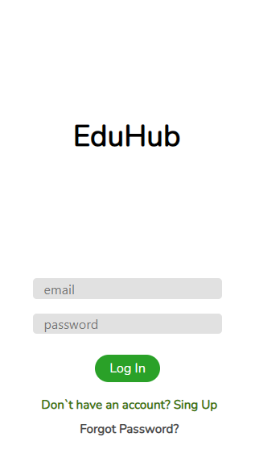

    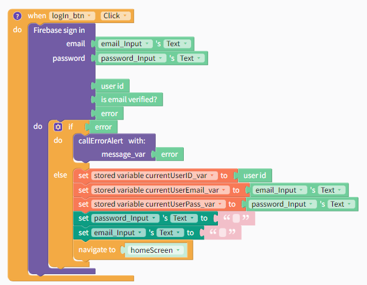

Se hace uso de la función **firebase sign in** de thunkable, haciendo uso del email y el password ingresado por el usuario mediante text inputs, firebase retorna error en caso de que alguno de los datos este incorrecto y se hace el despliegue de una alerta al usuario, donde se coloca el mesaje de error.

Hce uso de variables stored para guardar el userid, email y password en caso de que necesiten usarse en otras partes de la applicación.

Cuando la ventaja se va a cerrar para dirigirse al homeScreen, se "limpian" los campos y se abre la nueva ventana.

    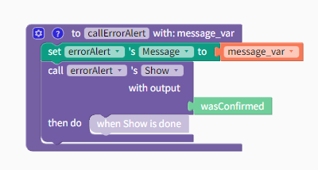

La función para llamar alertas recibe el mensaje y le muestra lo sigiente al usuario:

    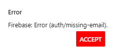

El mensaje va a variar de acuerdo al error.

    

También, el resto de botones tienen otros bloques de código para registrarse a la app o hacer la recupeción de la contraseña.

### **Sign In Screen**

Aquí el usario puede registrase a la app para ingresar a hacer la matricula, debido a que solo se implementa la parte de matricula, se asume que todos los usarios son estudiantes

    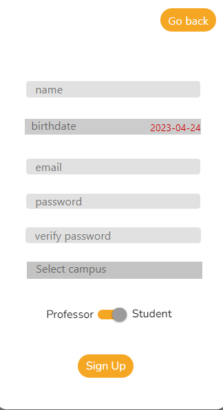

Aquí se definen las variables de app actualDate donde se coloca  la fecha actual, este se usa para las validaciones de la fecha de cumpleaños. Tambien se define userData_json para almacenar los datos que ingresa el usuario y enviarlos al api.

    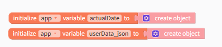

Cuando la ventana se abre se inicializan ciertos valores, el if verifica si es un nuevo usuario ingresando o solo cambio de ventana para cambiar el campus. Si solo cambio de ventana para lo del campus, no se cambia la fecha actual (la toma del date picker) y se cambia el texto de la label, si es un nuevo usuario, se hace el get date y se incializan otros valores.

    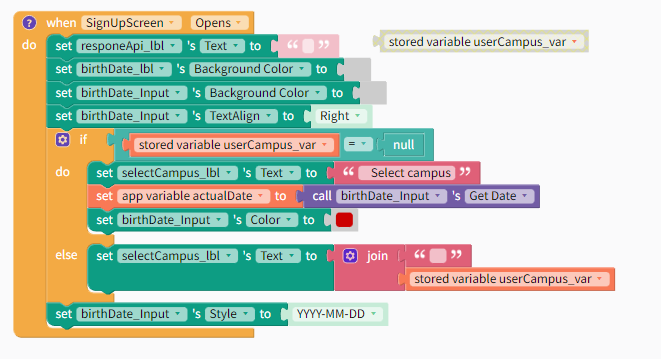

Cuando la ventana se abre se inicializan ciertos valores, el if verifica si es un nuevo usuario ingresando o solo cambio de ventana para cambiar el campus. Si solo cambio de ventana para lo del campus, no se cambia la fecha actual (la toma del date picker) y se cambia el texto de la label, si es un nuevo usuario, se hace el get date y se incializan otros valores.

    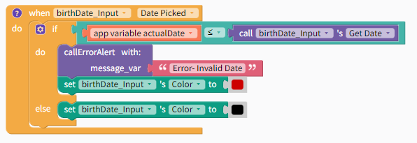

Cuando se selecciona una fecha de nacimiento se usa la variable que se inicializa al abrir la ventana, la de la fecha actual, se hace la verificación de si esta es menor o igual a la seleccionada, si se cumple la condición se llama a la función para un mensaje de error, notificando que la fecha es inválida porque es después de la fecha actual, además, el texto se coloca de color rojo para hacerle saber al usuario que esta mal. En caso contrario, se pone la fecha en color negro.

    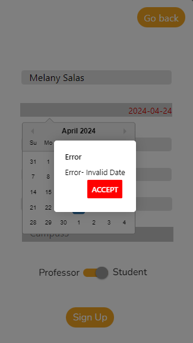

Por otro lado, cuando el usuario presiona el botón de  se hacen las distintas verificaciones de datos, entre ellas:

* Los password son iguales
* El campo del nombre esta lleno
* La fecha esta bien
* El campus ha sigo seleccionado

    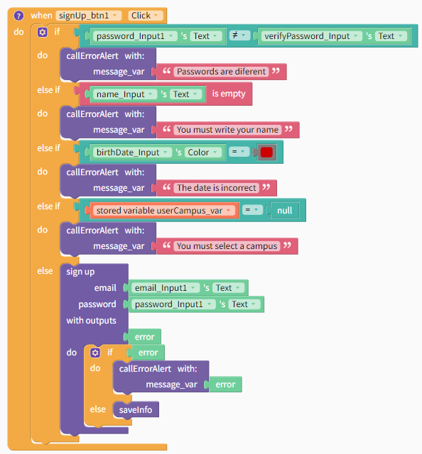

Demás verificaciones se hacen al llamar sign up de firebase, debido a que esta nos da verifiaciones de email.

    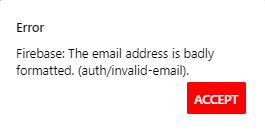

La funcion que hace el sign Up también llama a la función **saveInfo**, que hace el firebase sign in con el input del email y el password, posteriormente llama a la función de generateJSON.

    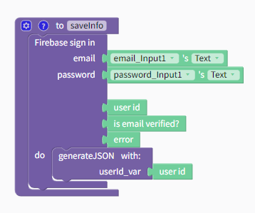

La función **generateJSON** se encarga de ponerle las propiedades al objeto que será 'parseado' a un JSON para enviárselo al API, es por esto que llama a la función connetAPI.

    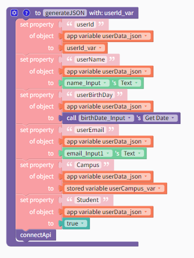

En connectAPI se hace el set el http al que nos vamos a conectar para mandar los datos del usuario y el queryParameter, que en este caso corresponde al JSON. Su usa la función callAPIAZURE y se hace un post, cuando se crea el usuario se le muestra un mensaje al usuario indicandole que su usuario se creo con éxito'.

    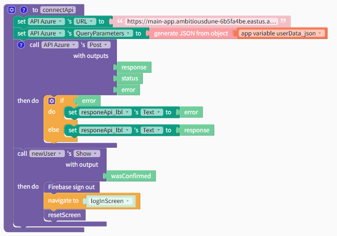

Tambien tiene otras opciones para cambiar entre ventanas

    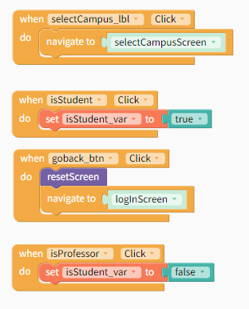

Envarias secciones se llama a la función **resetScreen** para que los datos regresen a los datos iniciales.

    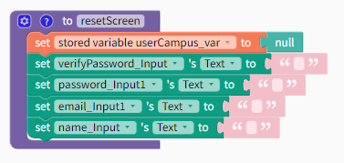

### **Home Screen**

### **Enroll Screen**

### **Check Enrollment Date Screen**

### **Enrolled Courses Screen**

### **Reset Password Screen**

    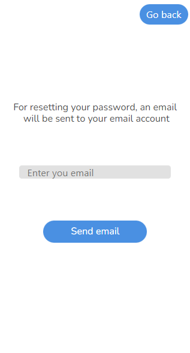

# **Conclusiones**

**1-** La comunicación entre el los miembros de grupo de trabajo es fundamental para un buen desarrollo del proyecto.

**2-** Se debe mantener una buena organización para poder realizar el trabajo.

**3-** Es de gran importancia entender los conceptos básicos vistos en clase para realizar el proyecto.

**4-** El tener un buen control de versiones y la correcta utilización de github facilita el trabajo en equipo.

**5-** Se deben aplicar buenas prácticas de programación para mantener el orden.

**6-** Mantener la estructura definida del proyecto es esencial para evitar el desorden.

**7-** Se debe desarollar un código legible y entendible.

# **Recomendaciones**

**1-** Hacer reuniones periódicas para discutir los avances del proyecto y mejorar la comunicación.

**2-** Mantener la organización de la tarea, siguiendo la infraestructura y recomendaciones dadas por el profesor.

**3-** Repasar los conceptos vistos en clase y complementar con investigación mejorar el entendimiento y aumentar la eficacia con la que se trabajará.

**4-** Aprender a hacer uso de github para el control de versiones y trabajo en conjunto.

**5-** Seguir un estándar de código.

**6-** Seguir aprendiendo y enriqueciendo el conocimiento después de finalizar el trabajo.

**7-** Investigar sobre las diferentes herramientas esenciales para desarrollar la solución e ir tomando apuntes sobre los aspectos importantes de cada uno de estas. Esto facilitará el desarrollo de la solución.

**8-** Tener una buena estructura del proyecto y dividir el proyecto de forma funcional para avanzar progresivamente.

**9-** Repartir y asignar tareas a cada integrante del equipo.

**10-** Definir roles en el equipo de trabajo para mantener el orden y procurar buena dinámica de trabajo.
