## **Instituto Tecnológico de Costa Rica**

## **IC4302 - Bases de Datos II**

## **Documentación Proyecto 1**

### **Profesor**: Nereo Campos Araya

### **Estudiantes**:

- Fiorella Zelaya Coto - 2021453615
- Isaac Araya Solano - 2018151703
- Melany Salas Fernández - 2021121147
- Moisés Solano Espinoza - 2021144322
- Pablo Arias Navarro - 2021024635

# **Diagrama entidad-relación**

    

La tabla Student, Professor y User heredan de la tabla User.

Se tiene la tabla Career. Esta entidad tiene relación n:n con User, por lo que existe la tabla CareerXUser, que registra los varios usuarios que pertenecen a varias carreras. Esta tabla también tiene relación n:n con File, por lo que existe la tabla CareerXFile.

Se tiene la tabla CareerPlan, que conecta con Career ya que los planes de estudio pertenecen a una carrera. Esta relacion es N:1. Los planes de carrera tienen un status, por lo que se relacionan con la tabla PlanStatus y su relación es de N:1. La tabla CareerPlan también tiene relación con Student, ya que los estudiantes pueden tener uno o más planes de carrera, si llevan una o más carreras. Esta relación es N:1.

Se tiene la tabla Campus. Esta entidad tiene relación con User, por lo que existe la tabla CampusXUser, que registra los varios usuarios que pertenecen a varios campus. 

Se tiene la tabla File. De esta entidad hereda la tabla Version, la cual registra las diferentes versiones que puede tener un archivo. Esta relación es N:1. La tabla File tiene relación con la tabla User, ya que registra el usuario que subió el archivo. Esta relación es N:1. También tiene relación con la tabla SchoolPeriod ya que registra el periodo en el que se subió el archivo. Esta relación es N:1. La tabla file tiene un FileType que se relaciona con la tabla FileType, esta relación es N:1.  También tiene relación con la tabla Course, ya que los archivos pueden pertenecer a un curso. Esta relación es N:N, por lo que existe la tabla CourseXFile. 

Se tiene la tabla Faculty. Esta entidad tiene relación con Course ya que los cursos pertenecen a una facultad. Esta relación es N:1. También tiene relación con Career, ya que las carreras pueden pertenecer a una facultad. Esta relación es N:1. También tiene relación con Professor, ya que los profesores pueden pertenecer a una facultad. Esta relación es N:N, por lo que existe la tabla ProfessorXFaculty.

Se tiene la tabla SchoolPeriod. Esta entidad tiene relación con PeriodType ya que los periodos tienen un tipo de periodo como Semestre o Cuatrimestre. Esta relación es N:1.También tiene relación con PeriodStatus ya que los periodos tienen un estado como En curso o Finalizado. Esta relación es N:1. 

Se tiene la tabla Course. Esta entidad tiene relación con Faculty ya que los cursos pertenecen a una facultad. Esta relación es N:1. También tiene relación con PeriodType ya que los cursos tienen un tipo de periodo como Semestre o Cuatrimestre. Esta relación es N:1. También tiene relación con CareerPlan ya que los cursos pertenecen a un plan de carrera. Esta relación es N:N, por lo que existe la tabla CourseXPlan. También tiene relación con CourseRequirement ya que los cursos pueden tener requisitos. Esta relación es N:1. También tiene relación con Student, ya que los estudiantes pueden llevar uno o más cursos. Esta relación es N:N, por lo que existe la tabla StudentXCourse.

La tabla CourseRequirement tiene relación con CourseXPlan ya que los requisitos de los cursos pertenecen a un plan de carrera. Esta relación es N:1.

Se tiene la tabla Enrollment. Esta entidad tiene relación con Student ya que los estudiantes pueden participar en muchas matriculas. Esta relación es N:N, por lo que existe la tabla StudentXEnrollment. También tiene relación con SchoolPeriod ya que las matriculas pertenecen a un periodo. Esta relación es N:1. También tiene relación con EnrollmentStatus ya que las matriculas tienen un estado como Abierta o Cerrada. Esta relación es N:1.

Se tiene la tabla WeeklySchedule que representa una tabla StudentXCourseGroup. Esta entidad representa los cursos que han sido matriculados por el estudiante.

Se tiene la tabla CourseGroup. Esta entidad tiene relación con Course ya que los grupos de cursos pertenecen a un curso. Esta relación es N:1. También tiene relación con Professor ya que los grupos de cursos pertenecen a un profesor. Esta relación es N:1. También tiene relación con SchoolPeriod ya que los grupos de cursos pertenecen a un periodo. Esta relación es N:1. También tiene relación con la tabla GroupXFile ya que los grupos de cursos pueden tener archivos. Esta relación es N:N.

Se tiene la tabla Schedule. Esta entidad tiene relación con CourseGroup ya que los horarios pertenecen a un grupo de cursos. Esta relación es N:N por lo que existe la tabla GroupXSchedule. 

La entidad Schedule también tiene relación con la tabla Day, ya que los horarios tienen uno o vario días. Esta relación es N:N, por lo que existe la tabla ScheduleXDay.

Se tiene la tabla CourseEvaluation que representa la evaluación anónima de los estudiante de un grupo/profesor. Esta entidad tiene relación con CourseGroup ya que las evaluaciones pertenecen a un grupo de cursos. Esta relación es N:1.

Se tiene la tabla Evaluation. Esta entidad tiene relación con Item, ya que las evaluaciones tienen uno o más items. Esta relación es N:1. También tiene relación con EvaluationType ya que las evaluaciones tienen un tipo como Examen o Tarea. Esta relación es N:1.

La tabla Item tiene relación con Student ya que los items tienen la calificación de los estudiantes de dicho rubro. Esta relación es N:N, por lo que existe la tabla StudentXItem.

# **Enlace a proyecto Thunkable**

[Proyecto Thunkable](https://x.thunkable.com/copy/41a90159e95f29d6a3fa2bd8f1334243)

# **Instrucciones de ejecución**

1-

2-

3-

## Intrucciones de proyecto de thunkable

1- Abrir el navegador de preferencia.

2- Buscar [Thukable](https://thunkable.com/#/)

3- Iniciar sesión o crearse una cuenta

4- Abrir el link [Proyecto Thunkable](https://x.thunkable.com/copy/41a90159e95f29d6a3fa2bd8f1334243)

5- Ejecutar desde web preview, desde la ventana **logInScreen**

    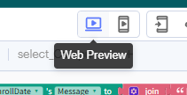

6- Utilizar la app

**Nota:** Se recomienda ingresar con el usuario **sarah.lee@example.com**, password sarah.lee@example.com, debido a que es el que más datos para pruebas tiene. Si crea un nuevo usuario no podrá matricular porque no tiene asigados periodos de matricula, carrera...

# **Pruebas realizadas**

## Pruebas de Thunkable

[Prueba 1 Thunkable](https://youtu.be/Z0nLTqFeTK4)

[Prueba 2 Thunkable](https://youtu.be/AZp8zoKrgHg)

# **Resultados de pruebas unitarias**

# **Componentes**

## **APIS**

## **Firebase**

Firebase se utiliza para la autenticación de los usuarios que se crean desde el proyecto Thunkable, se hace mediante correo electrónico y password.

    

## **NodeJS**

## **Thunkable**

### **Log In Screen**

En la pantalla  de inicio de sesión el usuario debe ingresar el email y el password que se encuentra reguistrado en firebase.

    

    

Se hace uso de la función **firebase sign in** de thunkable, haciendo uso del email y el password ingresado por el usuario mediante text inputs, firebase retorna error en caso de que alguno de los datos este incorrecto y se hace el despliegue de una alerta al usuario, donde se coloca el mesaje de error.

Hce uso de variables stored para guardar el userid, email y password en caso de que necesiten usarse en otras partes de la applicación.

Cuando la ventaja se va a cerrar para dirigirse al homeScreen, se "limpian" los campos y se abre la nueva ventana.

    

La función para llamar alertas recibe el mensaje y le muestra lo sigiente al usuario:

    

El mensaje va a variar de acuerdo al error.

    

También, el resto de botones tienen otros bloques de código para registrarse a la app o hacer la recupeción de la contraseña.

### **Sign In Screen**

Aquí el usario puede registrase a la app para ingresar a hacer la matricula, debido a que solo se implementa la parte de matricula, se asume que todos los usarios son estudiantes

    

Aquí se definen las variables de app actualDate donde se coloca  la fecha actual, este se usa para las validaciones de la fecha de cumpleaños. Tambien se define userData_json para almacenar los datos que ingresa el usuario y enviarlos al api.

    

Cuando la ventana se abre se inicializan ciertos valores, el if verifica si es un nuevo usuario ingresando o solo cambio de ventana para cambiar el campus. Si solo cambio de ventana para lo del campus, no se cambia la fecha actual (la toma del date picker) y se cambia el texto de la label, si es un nuevo usuario, se hace el get date y se incializan otros valores.

    

Cuando la ventana se abre se inicializan ciertos valores, el if verifica si es un nuevo usuario ingresando o solo cambio de ventana para cambiar el campus. Si solo cambio de ventana para lo del campus, no se cambia la fecha actual (la toma del date picker) y se cambia el texto de la label, si es un nuevo usuario, se hace el get date y se incializan otros valores.

    

Cuando se selecciona una fecha de nacimiento se usa la variable que se inicializa al abrir la ventana, la de la fecha actual, se hace la verificación de si esta es menor o igual a la seleccionada, si se cumple la condición se llama a la función para un mensaje de error, notificando que la fecha es inválida porque es después de la fecha actual, además, el texto se coloca de color rojo para hacerle saber al usuario que esta mal. En caso contrario, se pone la fecha en color negro.

    

Por otro lado, cuando el usuario presiona el botón de  se hacen las distintas verificaciones de datos, entre ellas:

* Los password son iguales
* El campo del nombre esta lleno
* La fecha esta bien
* El campus ha sigo seleccionado

    

Demás verificaciones se hacen al llamar sign up de firebase, debido a que esta nos da verifiaciones de email.

    

La funcion que hace el sign Up también llama a la función **saveInfo**, que hace el firebase sign in con el input del email y el password, posteriormente llama a la función de connectApi con el url con el que se va a llamar al API.

    

En connectAPI se hace el set el http al que nos vamos a conectar para mandar los datos del usuario. Su usa la función **call API azure** y se hace un post, cuando se crea el usuario se le muestra un mensaje al usuario indicandole que su usuario se creo con éxito'.

    

Tambien tiene otras opciones para cambiar entre ventanas

    

En varias secciones se llama a la función **resetScreen** para que los datos regresen a los datos iniciales.

    

### **Home Screen**

    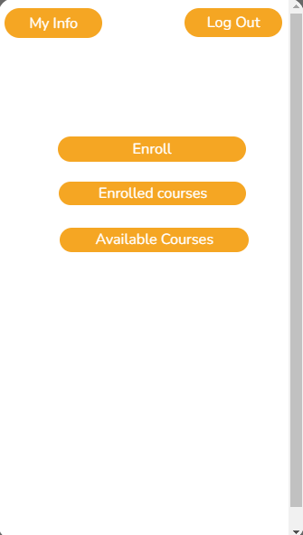

Esta es la ventana principal y la que hace que el estudiante vea las distintas funcionalidades para la matricula. Cuando se abre, toma la hora de matricula más reciente del estudiante, esta será usada después.

    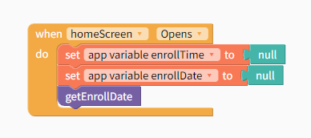

Esto se hace con un llamado al api y parseando el JSON de la respuesta.

    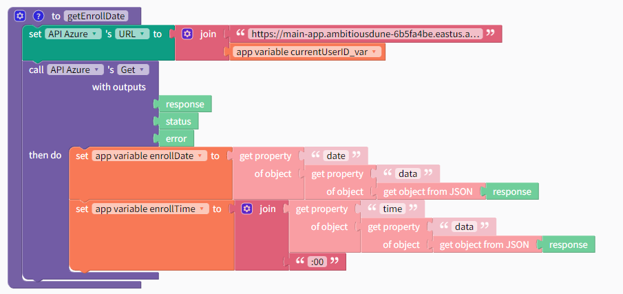

Al presionar log out, primero se preguntará por confirmación por parte del usuario y posteriormente, si confirma que quiere salirse, se procede a llamar a la función sign out de firebase y regresa a la ventana principal.

    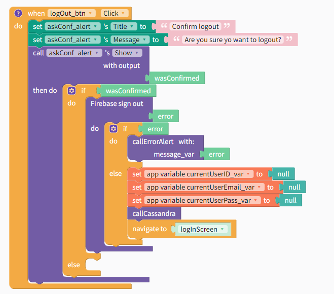

### **Enroll Screen**

En esta ventana el estudiante puede matricular los cursos de interés, en esta, los cursos "matriculados" se verán en la list viewer de color verde, los cursos tentativamente matriculados (si se hubieran implementado) se verían de color verde.

    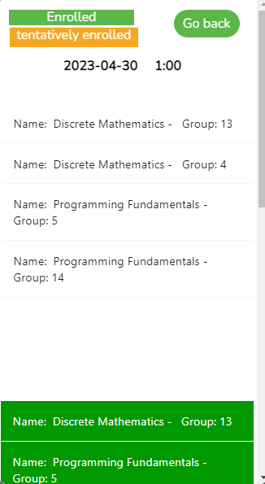

Cuando la ventana se abre se ejecutarán varias funciones para incializar la ventana.

    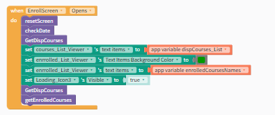

Para obtener los cursos se llama a la función **getDispCourses**, que se conecta al API. Llama a la función para parsear el JSON de lo que responde el API.

    

La función que hace el parse del JSON hace uso de dos listas, una de objetos y otra de que solo tiene el nombre y el grupo (esta es la que se despliega en el list viewer), la de objetos se usa para hacer verificación y/o obtención de algunos valores. Cuando termina el parseo del JSON, se colocan los text items a los cursos disponibles.

    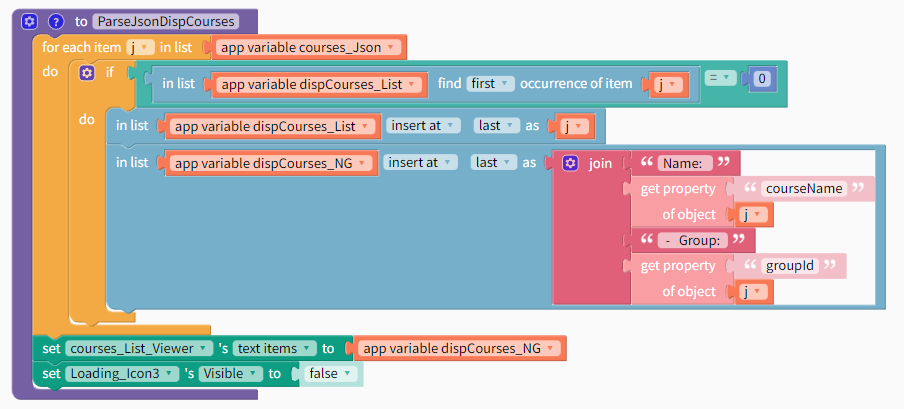

Para el parseo de los cursos disponibles se hace igual, tambien hace uso de dos listas, en este caso, una solo tiene el nombre y el grupo y otra tiene el nombre  de los cursos matriculados, para hacer verificaciones.

Cuando se hace click en uno de los cursos se toma como si lo estuviera matriculando, por esto, se hace la verificación de si el nombre ya existe en la lista de nombres, si no existe, se agregan a las listas cursos matriculados, si ya estaba en la lista de nombres, se le notifica al usuario.

    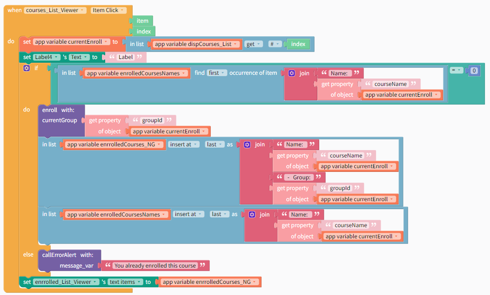

Al seleccionar se llama a la función Enroll, esta se conecta al API para enviar el id del curso matriculado.

    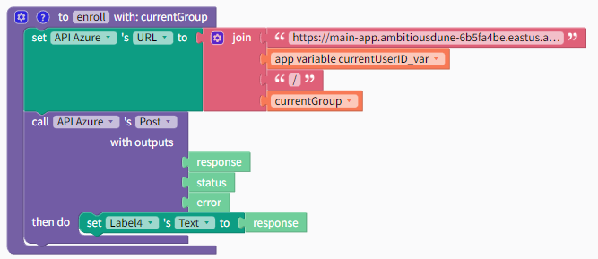

Por otro lado, si se hace click en una de las materias que ya se encuentran matriculadas, el sistema lo va a tomar como si lo estuviera desmatriculando, por esto, se le pregunta al usuario si esta seguro de que quiere desmatricular.

    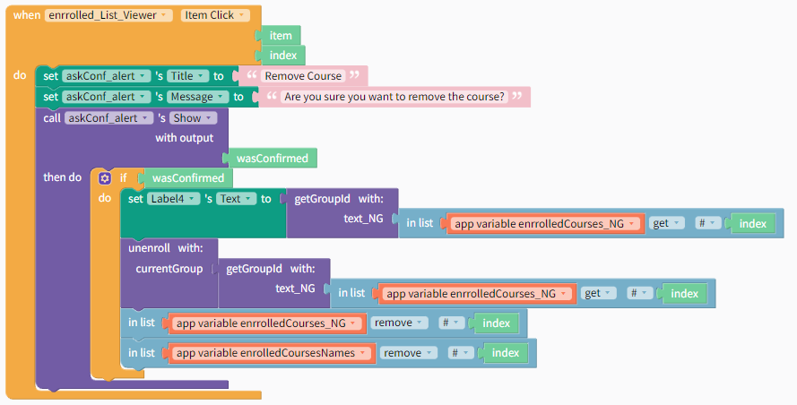

Por último,para la verificación de la fecha se toma la fecha actual y se verifica si es mayor o menor, igual con la hora.

    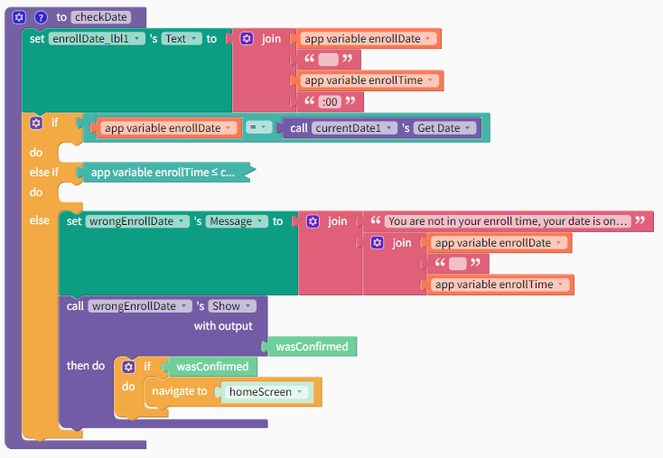

### **Enrolled Courses Screen**

Cuando la ventana se abre se inicializan ciertos valores y se llama a la función para llamar al API y optener los cursos en los que el estudiante está matriculado.

    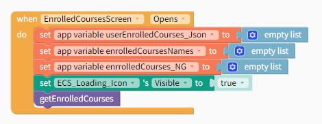

Funciona de forma similar al de los cursos matriculados en la ventana matricula.

### **My Info Screen**

    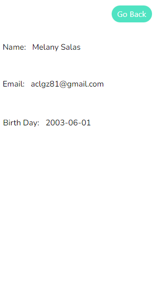

En esta ventana se podrá ver la información del usuario, como nombre, fecha de nacimiento y correo electrónico.

Para obtener la información se conecta al api y envía el userID, el api regresa un JSON que es parseado y se hace el set en las labels de la ventana.

### **Select Campus Screen**

En esta ventana el usuario tiene la opción de seleccionar el campus en el que se encuentra matriculado.

    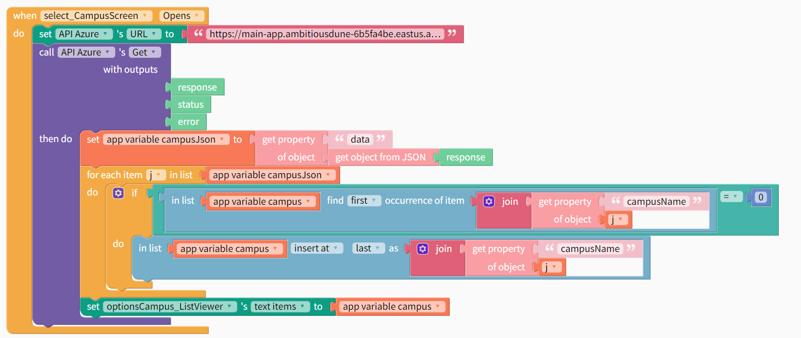

Se conecta al API para obtener los campus que se encuentran en la base de datos, se parsea el JSON que retorna el API, los agrega a una lista donde se pone el nombre, esto permite que el usuario seleccione la opción de preferencia.

    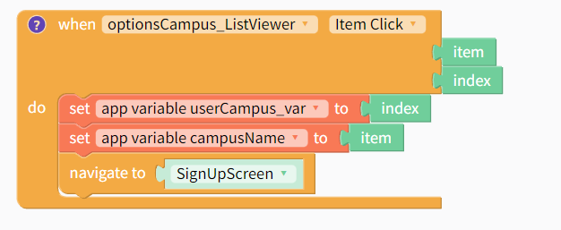

Cuando se hace la selección del campus, se le asigna el nombre del campus a una variable para que se vea en la ventana SignIn y el index del campus seleccionado.

### **Avalilable Courses Screen**

En esta ventana el usuario puede visualizar los cursos que pueden matricular.

    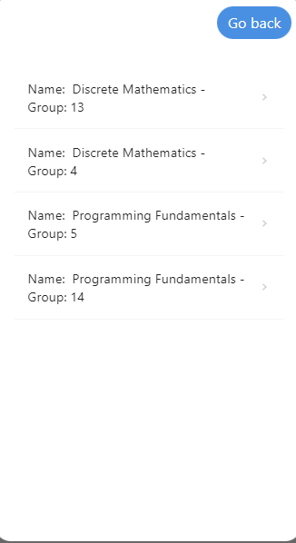

Cuando la ventana se abre se inicializa una varialble para guardar una lista con los nombres de los cursos, otra para guardar toda la información de cada curso en objetos y la última, para guardar la información del curso que seleccionó el usuario y desplegarla en otra ventaja. Llama a la función **GetDispCourses**, esta se conecta al API y llama a la función para parsear el json que responde el API y se despliega la info y se despliega la lista de cursos en la list View.

    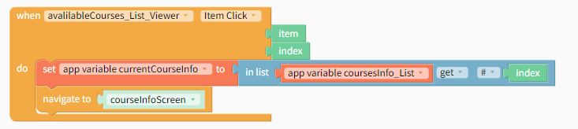

Cuando se selecciona un curso, se redirige a la ventana CourseInfo, para desplegar la información general del curso.

### **Course Info Screen**

En esta ventana se toma el object seleccionado en la ventana anterior y se despliega información como nombre del curso, grupo, evaluación de desempeño... Para hacerklo solo toma el objeto de la variable que se asigno en la ventana a cursos disponibles y se le hace un set a las labels disponibles en la ventana.

    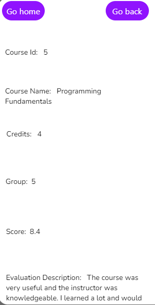

Tambien se puede regresar a la ventana anterior y a la ventana home, segun el usuario prefiera.

### **Reset Password Screen**

    

En la ventana reset password un usuario podrá solicitar que se le envíe un email al correo registrado, esto se envía desde firebase para se que cambie el password mediante un link que se envía.

En la ventana se puede presionar go back, al realizar esta acción va a dirigir nuevamente a la ventana log in sin haber realizado el cambio.

    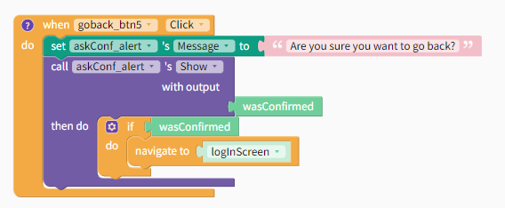

Al presionar el botón para enviar el email se le pregunta al usuario si esta seguro sobre el cambio de contraseña, si lo están se procede a usar la función de reset password con el email del usuario.

    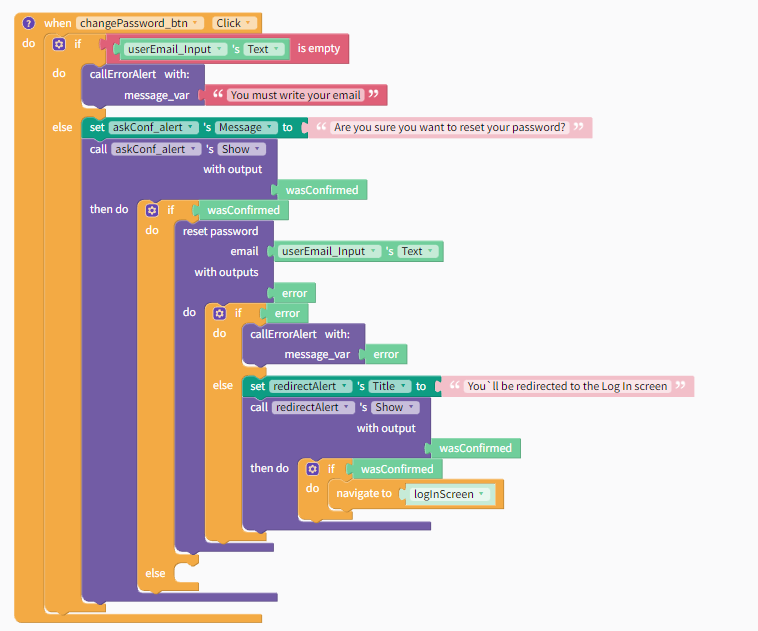

# **Conclusiones**

**1-** La comunicación entre el los miembros de grupo de trabajo es fundamental para un buen desarrollo del proyecto.

**2-** Se debe mantener una buena organización para poder realizar el trabajo.

**3-** Es de gran importancia entender los conceptos básicos vistos en clase para realizar el proyecto.

**4-** El tener un buen control de versiones y la correcta utilización de github facilita el trabajo en equipo.

**5-** Se deben aplicar buenas prácticas de programación para mantener el orden.

**6-** Mantener la estructura definida del proyecto es esencial para evitar el desorden.

**7-** Se debe desarollar un código legible y entendible.

**8-** Se debe organizar el equipo de trabajo desde el día 1.

**9-** Se dene tener una estruuctura clara y ordenada del proyecto y lo que requiere.

**10-** Es importante implementar el uso de 'cajas negras' para mantener el proyecto avanzando, aún si hay partes no funcionales.

# **Recomendaciones**

**1-** Hacer reuniones periódicas para discutir los avances del proyecto y mejorar la comunicación.

**2-** Mantener la organización de la tarea, siguiendo la infraestructura y recomendaciones dadas por el profesor.

**3-** Repasar los conceptos vistos en clase y complementar con investigación mejorar el entendimiento y aumentar la eficacia con la que se trabajará.

**4-** Aprender a hacer uso de github para el control de versiones y trabajo en conjunto.

**5-** Seguir un estándar de código.

**6-** Seguir aprendiendo y enriqueciendo el conocimiento después de finalizar el trabajo.

**7-** Investigar sobre las diferentes herramientas esenciales para desarrollar la solución e ir tomando apuntes sobre los aspectos importantes de cada uno de estas. Esto facilitará el desarrollo de la solución.

**8-** Tener una buena estructura del proyecto y dividir el proyecto de forma funcional para avanzar progresivamente.

**9-** Repartir y asignar tareas a cada integrante del equipo.

**10-** Definir roles en el equipo de trabajo para mantener el orden y procurar buena dinámica de trabajo.
