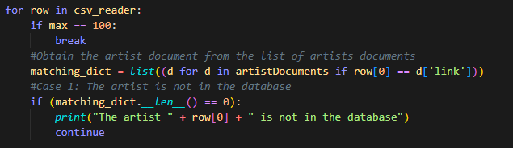
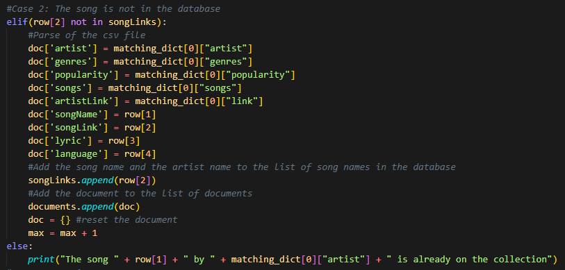
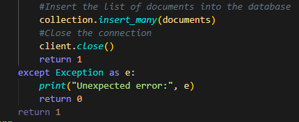

## **Instituto Tecnológico de Costa Rica**

## **IC4302 - Bases de Datos II**

## **Documentación Proyecto 2**

### **Profesor**: Nereo Campos Araya

### **Estudiantes**:

- Fiorella Zelaya Coto - 2021453615
- Isaac Araya Solano - 2018151703
- Melany Salas Fernández - 2021121147
- Moisés Solano Espinoza - 2021144322
- Pablo Arias Navarro - 2021024635

# **Instrucciones para ejecutar su proyecto**

# **Componentes**

## **Loader**

### **Parse Artists.csv**

Se define la función parseArtists para hacer la lectura y el parseo de los artistas de los archivos de artistas.

    

 Lo primero que se hace en la  función es abrir la conexión de Mongo DB, se envía un ping para comprobar que la conexión es correcta.

    

Después, definimos la base de datos y la collection que se va a usar para cargar/bajar datos a Mongo Atlas.

    

También, se define un csv reader para hacer la lectura y parseo del csv de artistas, además, se deffine el delimitador por el cual se separan los campos y se hace un skip de la fila del header.

    

Posteriormente se define una lista para almacenar los documentos que serán insertados en la collection de Mongo y un documento que almacena la información del artista que se está leyendo actualmente. También existe la variable **artistsNames** para obtener los nombres de los artistas que existen actualmente en Mongo, esto se usa para hacer la verificación de los artistas que ya han sido agregados a la collection. Se define un max en caso de que se desee limitar la cantidad de artistas que se van a subir a la collection.

    

El el ciclo para recorrer las filas del csv se verifica si se llegó al límite de artistas subidos a Mongo, si aun no se ha alcanzado, se verifica si el nombre del artista esta en la lista de artistsNames, si no esta, debe ser agregado a la lista de documentos, para esto se hace el parse y se le asigna los valores correspondientes a cada parse del documento, para genres de hace un split con el ";" para almacenar los genres como una array.

    

Se usa la función insert_many para insertar todos los documentos a Mongo y se cierra el cliente.

    

Finalmente, si hay un error se despliega el error en la consola.

### **Parse Lyrics.csv**

Se define la función parseArtists para hacer la lectura y el parseo de los artistas de los archivos de artistas.

    

 Lo primero que se hace en la  función es abrir la conexión de Mongo DB, se envía un ping para comprobar que la conexión es correcta.

    

Después, definimos la base de datos y la collection que se va a usar para cargar/bajar datos a Mongo Atlas. Adicionalmente, se define la artistsCollection para obtener los artistas existentes en Mongo.

    

También, se define un csv reader para hacer la lectura y parseo del csv de artistas, además, se deffine el delimitador por el cual se separan los campos y se hace un skip de la fila del header.

    

Posteriormente se define una lista para almacenar los documentos que serán insertados en la collection de Mongo y un documento que almacena la información del lyric que se está leyendo actualmente. También existe la variable **artistsDocuments** para obtener los que están en artistas en Mongo, esto se usa para agregar la información del artista a cada lyric. También, se define una lista con los songLink que hay en la base de datos, para evitar agregar duplicados.Adicionalmente, se define un max en caso de que se desee limitar la cantidad de artistas que se van a subir a la collection.

    

Se define un ciclo paa ir por cada fila del csv. En este se verifica el max y también se obtiene el documento del artista que hace match con el link del autor del lyric, se verifica que este exista en la base de datos comprobando que matchingDict tenga un len superior a 0.

    

Para verificar que la canción no exista en la base de datos se verifica el songLink, en caso de que no exista se forma el documento y luego se agrega a la lista de documentos, tambien se agrega el songLink a la lsita de links y se vacia el documento actual.

    

Se usa la función insert_many para insertar todos los documentos a Mongo y se cierra el cliente. Finalmente, si hay un error se despliega el error en la consola.

## **API**

## **App de React**

# **Pruebas realizadas**

# **Resultados de las pruebas unitarias**

# **Conclusiones**

**1-** La comunicación entre el los miembros de grupo de trabajo es fundamental para un buen desarrollo del proyecto.

**2-** Se debe mantener una buena organización para poder realizar el trabajo.

**3-** Es de gran importancia entender los conceptos básicos vistos en clase para realizar el proyecto.

**4-** El tener un buen control de versiones y la correcta utilización de github facilita el trabajo en equipo.

**5-** Se deben aplicar buenas prácticas de programación para mantener el orden.

**6-** Mantener la estructura definida del proyecto es esencial para evitar el desorden.

**7-** Se debe desarollar un código legible y entendible.

**8-** Se debe organizar el equipo de trabajo desde el día 1.

**9-** Se debe tener una estruuctura clara y ordenada del proyecto y lo que requiere.

**10-** Es importante la división de trabajo para poder desarrollar todos los componentes.

# **Recomendaciones**

**1-** Hacer reuniones periódicas para discutir los avances del proyecto y mejorar la comunicación.

**2-** Mantener la organización de la tarea, siguiendo la infraestructura y recomendaciones dadas por el profesor.

**3-** Repasar los conceptos vistos en clase y complementar con investigación mejorar el entendimiento y aumentar la eficacia con la que se trabajará.

**4-** Hacer uso de github para el control de versiones y trabajo en conjunto.

**5-** Seguir un estándar de código.

**6-** Seguir aprendiendo y enriqueciendo el conocimiento después de finalizar el trabajo.

**7-** Investigar sobre las diferentes herramientas esenciales para desarrollar la solución e ir tomando apuntes sobre los aspectos importantes de cada uno de estas. Esto facilitará el desarrollo de la solución.

**8-** Tener una buena estructura del proyecto y dividir el proyecto de forma funcional para avanzar progresivamente.

**9-** Repartir y asignar tareas a cada integrante del equipo.

**10-** Definir roles en el equipo de trabajo para mantener el orden y procurar buena dinámica de trabajo.

# **Referencias bibliográficas donde aplique**