## **Instituto Tecnológico de Costa Rica**

## **IC4302 - Bases de Datos II**

## **Documentación Proyecto 2**

### **Profesor**: Nereo Campos Araya

### **Estudiantes**:

- Fiorella Zelaya Coto - 2021453615
- Isaac Araya Solano - 2018151703
- Melany Salas Fernández - 2021121147
- Moisés Solano Espinoza - 2021144322
- Pablo Arias Navarro - 2021024635

# **Instrucciones para ejecutar su proyecto**

# **Componentes**

## **Loader**

### **Parse Artists.csv**

Se define la función parseArtists para hacer la lectura y el parseo de los artistas de los archivos de artistas.

    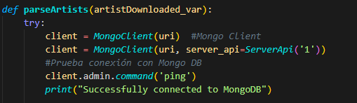

Lo primero que se hace en la función es abrir la conexión de Mongo DB, se envía un ping para comprobar que la conexión es correcta.

    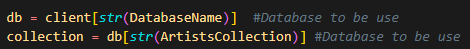

Después, definimos la base de datos y la collection que se va a usar para cargar/bajar datos a Mongo Atlas.

    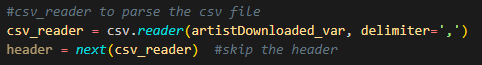

También, se define un csv reader para hacer la lectura y parseo del csv de artistas, además, se deffine el delimitador por el cual se separan los campos y se hace un skip de la fila del header.

    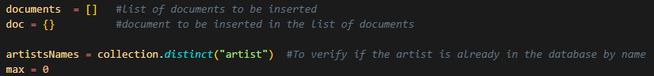

Posteriormente se define una lista para almacenar los documentos que serán insertados en la collection de Mongo y un documento que almacena la información del artista que se está leyendo actualmente. También existe la variable **artistsNames** para obtener los nombres de los artistas que existen actualmente en Mongo, esto se usa para hacer la verificación de los artistas que ya han sido agregados a la collection. Se define un max en caso de que se desee limitar la cantidad de artistas que se van a subir a la collection.

    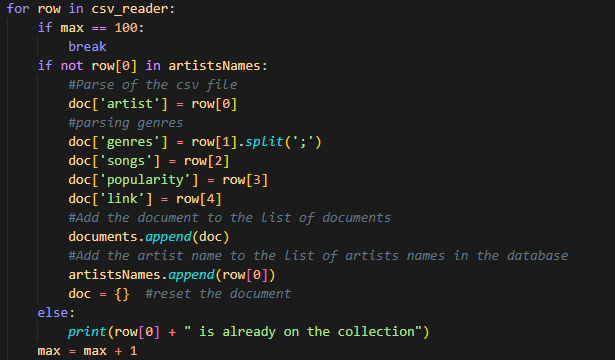

El el ciclo para recorrer las filas del csv se verifica si se llegó al límite de artistas subidos a Mongo, si aun no se ha alcanzado, se verifica si el nombre del artista esta en la lista de artistsNames, si no esta, debe ser agregado a la lista de documentos, para esto se hace el parse y se le asigna los valores correspondientes a cada parse del documento, para genres de hace un split con el ";" para almacenar los genres como una array.

    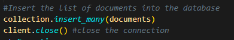

Se usa la función insert_many para insertar todos los documentos a Mongo y se cierra el cliente.

    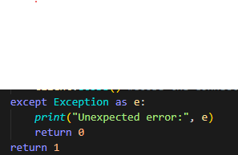

Finalmente, si hay un error se despliega el error en la consola.

### **Parse Lyrics.csv**

Se define la función parseLyrics para hacer la lectura y el parseo de las canciones de los archivos de letras de canciones.

    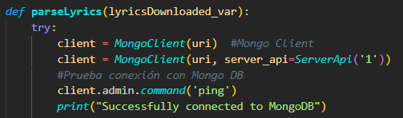

Lo primero que se hace en la función es abrir la conexión de Mongo DB, se envía un ping para comprobar que la conexión es correcta.

    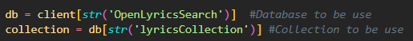

Después, definimos la base de datos y la collection que se va a usar para cargar/bajar datos a Mongo Atlas.

    

También, se define un csv reader para hacer la lectura y parseo del csv de artistas.

    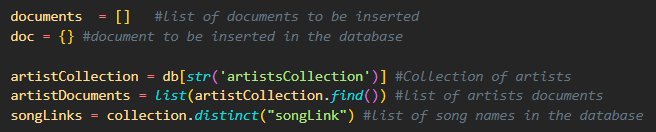

Por otro lado, se definen:

- "artistCollection": colección de artistas existentes en la base de datos.
- "artistDocuments": todos los documentos de la colección de artistas.
- "songLinks": lista de todos los nombres de canciones en la base de datos. Se define el delimitador por el cual se separan los campos.
- "documents": lista para los documentos que van a ser insertados en la base de datos.
- "doc": documento que se creará y almacenará la información del documentos "actual" dentro del for para insertarlo en documents.

También se define un max en caso de que se desee limitar la cantidad de artistas que se van a subir a la collection.

    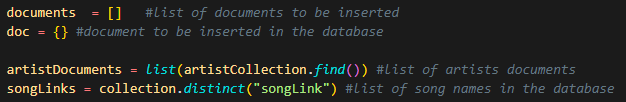

Se define un ciclo para ir por cada fila del csv. Primeramente, se obtiene el documento del artista que hace match con el link del autor del lyric que estamos recorriendo actualmente.

Para insertar datos se verifica lo siguiente:

1. La existencia del artista que se obtuvo mediante el link de la canción, comprobando que "matchingDict" tenga un len superior a 0.. En este caso, se imprime el mensaje en consola y se continua con la siguiente fila.
2. Verifica que la canción que se va a insertar no exista para evitar datos duplicados. Si la canción no existe, entonces se almacenan los datos en "doc" y luego se inserta en "documents".
   2.1. Si la canción ya existe, se imprime el mensaje en consola.

Ademas, se utiliza el link de la canción para verificar la unicidad del documento a insertar.

Este link se inserta a "songLinks" (localmente), lo que permite llevar el registro de las canciones que ya existen y las que estamos agregando para verificar que no se inserten datos duplicados en las siguientes iteraciones.

Luego de esto, se vacia el documento actual.

    

Se usa la función insert_many para insertar todos los documentos a Mongo y se cierra el cliente.

    

Finalmente, si hay un error se despliega el error en la consola.

### **Download File**

Se define la funcion DownloadFile para descargar los archivos desde Azure. Esta funcion recibe como parámetros el nombre del archivo a descargar y el path del archivo.

    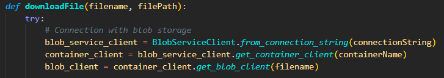

Primeramente, se realiza la conexión con el Blob Storage.

    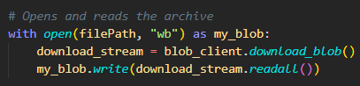

Luego, se crea el archivo en modo de escritura binaria utilizando el path recibido por parámetros. Se descarga el archivo desde el Blob Storage y se escribe en el archivo recién creado.

    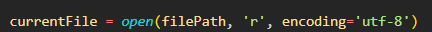

Posteriormente, se abre el archivo recién creado en modo lectura con encoding UTF-8 y se almacena en la variable “currentFile”.

    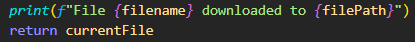

Para finalizar con el proceso de descargado, se imprime un mensaje de confirmación en consola y se retorna el archivo recién decargado desde Blob Storage.

    

Finalmente, si hay un error se despliega el error en la consola.

### **getAllBlobFiles**

Esta función se usa para obtener los archivos que estan en el blob storage y hacer el parseo de los archivos que aún no han sido procesados (Es decir, los que no están en el txt de archivos procesados que se encuentra en el Blob Storage).

    

Lo primero que se hace es hacer la conexión con el blob storage.

    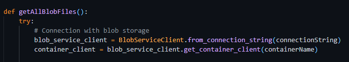

Despues, se optiene la lista de los blob en el container y se almacenan en la variable **blob_list**. Posteriormente, se descarga el txt que contiene los nombres de los archivos que ya han sido subidos utilizando la función **downloadFile()**.

    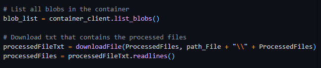

Despues, se obtienen los archivos que han sido procesados y se agregan a la lista de "files".

    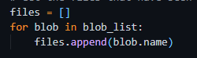

Se crea un nuevo archivo que va a ser usado para hacer el update del archivo con los nombres de los que ya han sido procesados. También se define la variable **content** y se inicializa con un string vacío. Esta variable almacenará el contenido del archivo actualizado.

Luego, se recorren los **filesnames** que estan en la lista de **files** y se verifica si este nombre ya esta en la lista de archivos procesados, si no esta, se verifica si el nombre del archivo tiene artists o lyrics en el filename. Además, se ignora el archivo que tiene los nombres de los archivos procesados. Finalmente, tenemos la variable **content**, en esta se van a agregar los nombres de los archivos que han sido procesados para actualizar el txt de archivos procesados en el Blob Storage.

    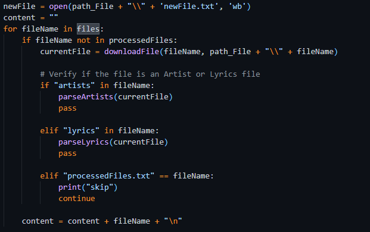

Finalmente, se escribe en el file lo que esta en la variable **content** y se cierra este archivo. Se llama a la función para hacer un el update del archivo en el blob.

    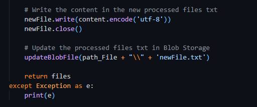

### **updateBlobFile**

Esta función hace un update de un archivo que se encuentra en el blob storage, en el cual se encuentran los nombres de los archivos que ya han sido procesados.

Primero, se establece la conexión al Blob Storage y se obtiene el archivo buscado (**processedFiles.txt**).

Luego, se abre un archivo en modo de lectura binaria, indicándole el path que recibe la función por parámetros. Este path es el path del archivo txt en el BlobStorage. Una vez abierto el archivo, se guarda el contenido (tipo lista) de este en la variable **content**.

Se intenta hacer un decode a la variable content. Si esto falla, entonces tira la excepción. Si no falla, continúa el proceso para convertir el contenido de esta lista en un string. Para hacer esto, se recorre la lista y se agrega cada línea a **newContent**, la cual es la variable que construye el string con el nuevo contenido.

Por último, se actualiza el archivo en el BlobStorage y se retorna un string de confirmación.

Finalmente, si hay un error se despliega el error en la consola.

    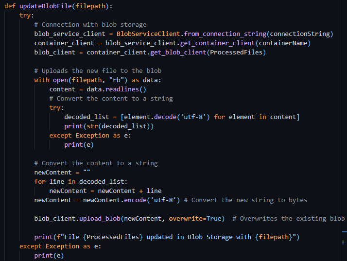

### **selectRandomGenre**

Esta función selecciona un genero random para los lyrics.

    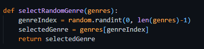

## **MongoDB**

    

Se definen la base de datos OpenLyricsSearch con las collections artist y Lyrics, además, se define un índice con los facets para hacer consultas sobre la información de lyrics.

    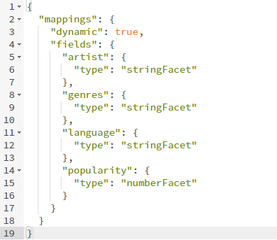

## **API**

## **App de React**

### **Organización del proyecto**

La aplicación web de este proyecto fue realizada utilizando React JS. Para crearlo se utilizó vite. Se le puso de nombre open lyrics.

**Como estandarización para desarrollar el proyecto se determinó:**

- Empezar el nombre de las rutas y componentes con mayúscula y luego usar camelcase.
- Crear un file.module.css diferente para cada .jsx que contenga html.
- Utilizar las imágenes en ./public y las fuentes en ./fonts.
- Si se utilizan valores 'quemados', estos se deberán transferir al archivo de constantes para tener un mejor control de estos y poder reutilizarlos en la aplicación.
- Si hay elementos visuales que se comparten entre rutas, entonces se utilizará una ruta madre y luego se tendrán las otras rutas adentro de esta.
- Si hay partes del código que se ocupan reutilizar en otro lado, se convertirán en componentes .jsx.
- Manejar una buena documentación interna.
- No mantener imports que no se utilicen en los archivos .jsx.

A continuación se muestra el directorio de la aplicación. Se manejan las siguientes carpetas:

- **./fonts** para guardar las tipografías utilizadas en la interfaz.
- **./node_modules** contiene la instalación de los módulos.
- **./public** contiene las imágenes de la interfaz y el favicon.
- **./src** es la carpeta en la que está toda la lógica de la app, esta se explicará en detalle más adelante.
- **./** es la ruta principal y aquí se encuentra el index.html, los json de configuración y el .gitignore para poder utilizar el proyecto en Github.

    

 Se van a ir describiendo cada una de estas carpetas para comprender por completo la estructura de la aplicación web.

#### **1) ./fonts**

    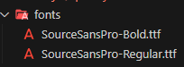

Sourcer Sans Pro es la fuente elegida para utilizar en la interfaz. Como no es una fuente que está por defecto en html se descargaron los archivos .ttf y se colocaron aquí para posteriormente ser importadas como las fuentes por defecto de la aplicación.

#### **2) ./node_modules**

    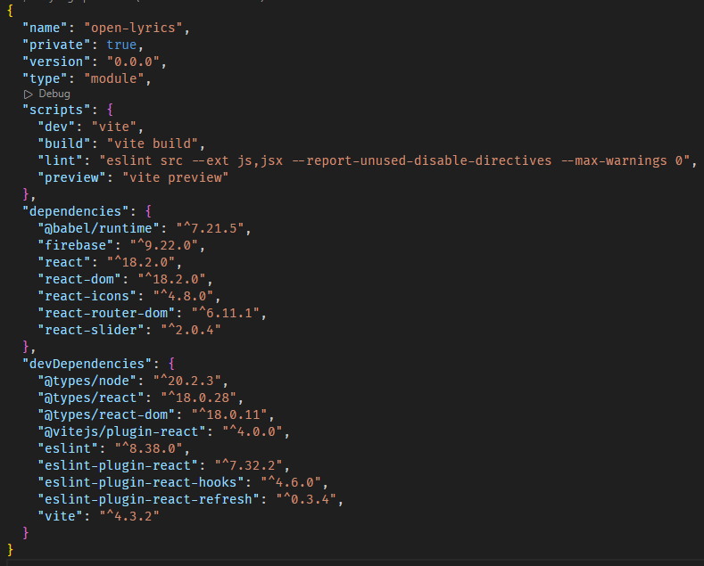

En esta carpeta están instalados todos los módulos necesarios para que la aplicación funcione. En la imágen se muestra el nombre de las dependencias utilizadas. Para cada una de estas se tuvo que ejecutar el `npm install {name}`.

#### **3) ./public**

    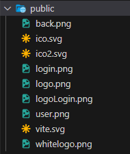

En esta carpeta guardamos las imágenes. Como es la carpeta public no se ocupa poner la ruta en el momento de llamar a los recursos. Se guardan los logos, íconos y favicon.

#### **4) ./src**

    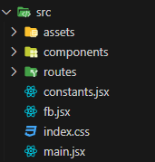

Esta es la carpeta que contiene todo el código de la aplicación. Como es un proyecto de Vite todos los archivos son .jsx. Esto se divide en components y routes. El archivo main.jsx es el archivo principal de la aplicación, en el que se configura el router y las rutas a utilizar. Se tiene el archivo constants.jsx que va a tener los valores que se utilizan en todo lugar de la app, fb.jsx contiene la configuración de firebase.

    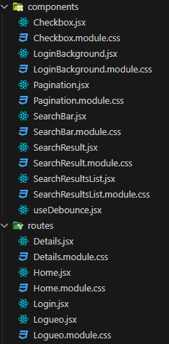

En components están los componentes que se reutilizan en react. Se utiliza de esta forma para hacelo más modular y comprender mejor cómo funciona el código. Para cada componente se tiene su propio archivo de estilo. Lo utilizamos de una forma diferente, en vez de llamar los archivos {name}.css los nombramos {name}.module.css. Esto se hace para poder especificar los estilos específicos para cada elemento del html.

En routes se guardan las rutas de la aplicación. En la especificación se determina que se ocupan cuatro rutas: Login, Create User, Home y Details. Para la ruta de Login y Create User se utilizan los archivos Login.jsx y Logueo.jsx. Para el Home se utiliza Home.jsx y para Details Details.jsx.

### **Explicación del código**

#### **constants.jsx**

    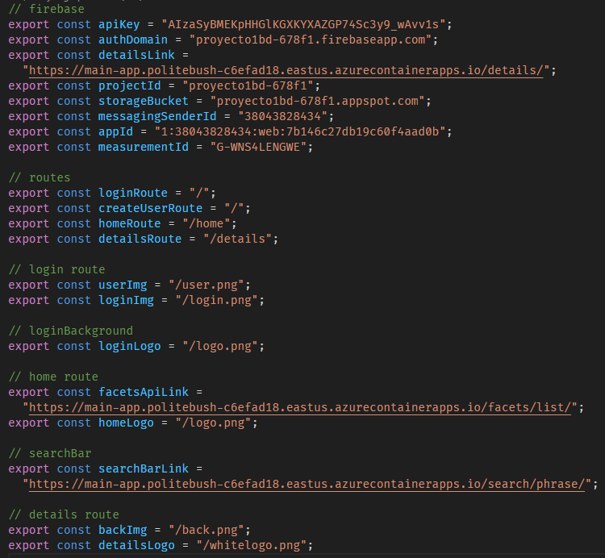

En este archivo se tienen todos los valores que se utilizan en la aplicación. Con comentarios se organiza a qué corresponden cada constante. Se exportan para poder ser utilizadas e importadas desde otros archivos.

#### **main.jsx**

    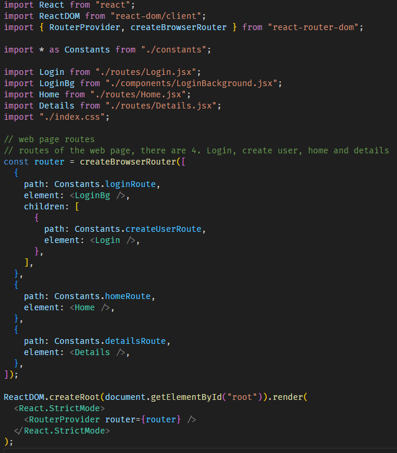

Se crea el router de rutas. Se crea LoginBG que es el background del login y create user. Como es el mismo fondo entonces es la ruta madre y esta tendrá de hija a Login. Las otras rutas son Home y Details.

Ya en la parte inferior se renderizan las rutas con el RouterProvider. Esto hace que la interfaz comience a funcionar. Todos los nombres de las rutas se importan desde el archivo de constantes.

#### **firebase.jsx**

    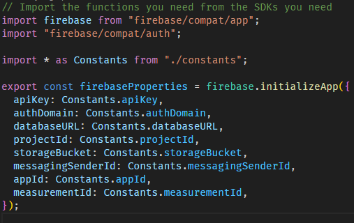

Contiene la configuración de firebase desde el SDK para poder usar la autenticación. Se exporta esta configuración.

#### **index.css**

    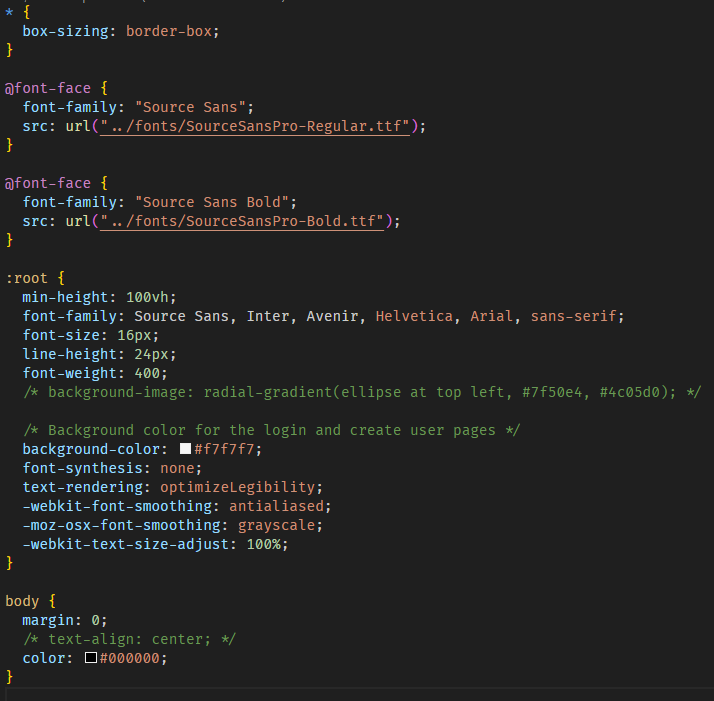

En este css está la configuración general de la aplicación. Se importan las fuentes y se les coloca el nombre a utilizar. También se coloca el color del fondo y otros valores por defecto para que sean heredados a todos los archivos de la página.

#### **login.jsx**

    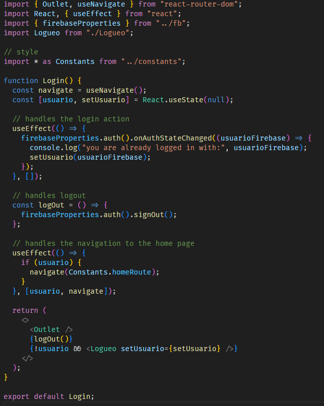

Se importan los datos de firebase para manejar el inicio de sesión y la creación de los usuarios. En este jsx no se maneja el html, en este está la lógica de autenticación. Si se logra iniciar sesión, el usuario será redirigido a la ruta Home para que pueda empezar a hacer las búsquedas.

#### **logueo.jsx**

    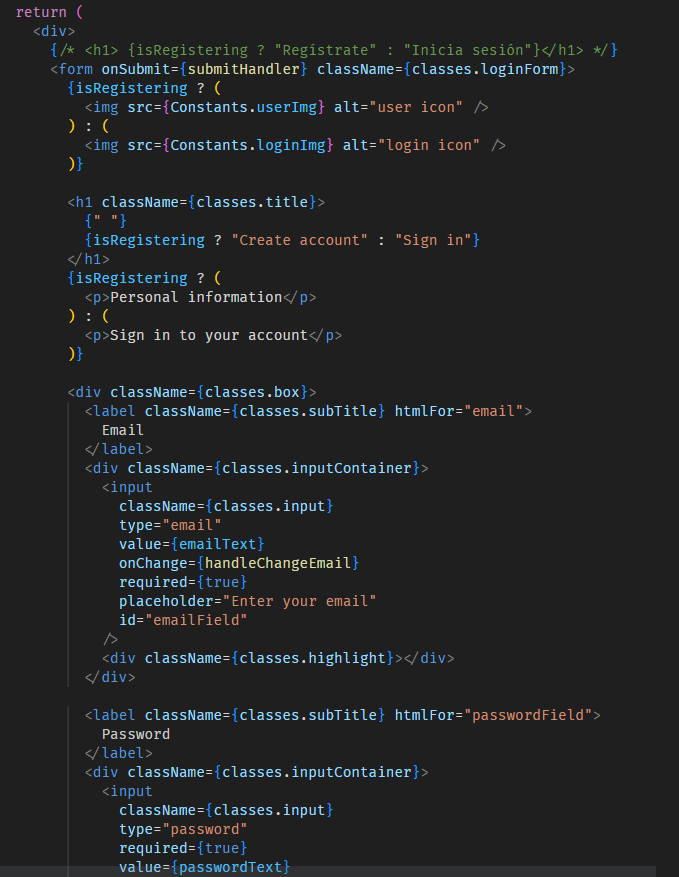

Este solo es un fragmento de este archivo. En este también se utiliza firebase para poder hacer la creación o inicio de sesión. Para la interfaz se usa un form con los campos de email y contraseña. Estos dos inputs deben ser llenados para poder ingresar. Si ocurre un error la aplicación lo notificará. Cuando se crea un usuario la sesión se iniciará automáticamente y se redigirá a Home.

Aquí se evidencia cómo es que se le dan los estilos a los elementos del html utilizando el elemnto importado llamado `classes`.

#### **checkbox.jsx**

    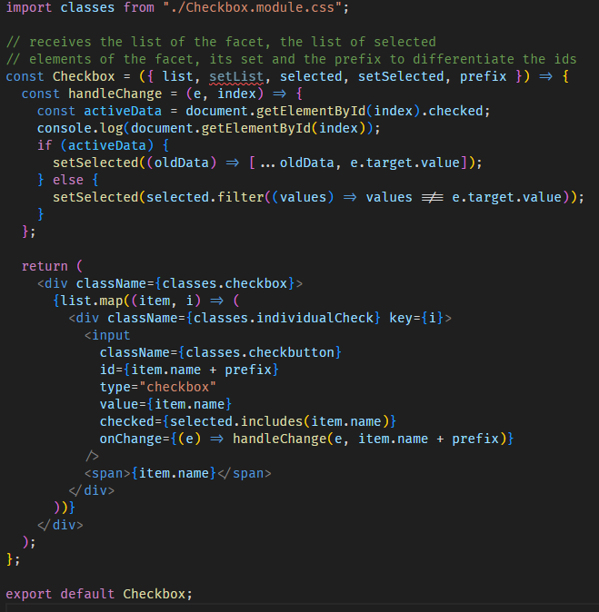

# **Pruebas realizadas**

# **Resultados de las pruebas unitarias**

# **Conclusiones**

**1-** La comunicación entre el los miembros de grupo de trabajo es fundamental para un buen desarrollo del proyecto.

**2-** Se debe mantener una buena organización para poder realizar el trabajo.

**3-** Es de gran importancia entender los conceptos básicos vistos en clase para realizar el proyecto.

**4-** El tener un buen control de versiones y la correcta utilización de github facilita el trabajo en equipo.

**5-** Se deben aplicar buenas prácticas de programación para mantener el orden.

**6-** Mantener la estructura definida del proyecto es esencial para evitar el desorden.

**7-** Se debe desarollar un código legible y entendible.

**8-** Se debe organizar el equipo de trabajo desde el día 1.

**9-** Se debe tener una estruuctura clara y ordenada del proyecto y lo que requiere.

**10-** Es importante la división de trabajo para poder desarrollar todos los componentes.

# **Recomendaciones**

**1-** Hacer reuniones periódicas para discutir los avances del proyecto y mejorar la comunicación.

**2-** Mantener la organización de la tarea, siguiendo la infraestructura y recomendaciones dadas por el profesor.

**3-** Repasar los conceptos vistos en clase y complementar con investigación mejorar el entendimiento y aumentar la eficacia con la que se trabajará.

**4-** Hacer uso de github para el control de versiones y trabajo en conjunto.

**5-** Seguir un estándar de código.

**6-** Seguir aprendiendo y enriqueciendo el conocimiento después de finalizar el trabajo.

**7-** Investigar sobre las diferentes herramientas esenciales para desarrollar la solución e ir tomando apuntes sobre los aspectos importantes de cada uno de estas. Esto facilitará el desarrollo de la solución.

**8-** Tener una buena estructura del proyecto y dividir el proyecto de forma funcional para avanzar progresivamente.

**9-** Repartir y asignar tareas a cada integrante del equipo.

**10-** Definir roles en el equipo de trabajo para mantener el orden y procurar buena dinámica de trabajo.

# **Referencias bibliográficas donde aplique**
