## **Instituto Tecnológico de Costa Rica**

## **IC4302 - Bases de Datos II**

## **Documentación Proyecto 2**

### **Profesor**: Nereo Campos Araya

### **Estudiantes**:

- Fiorella Zelaya Coto - 2021453615
- Isaac Araya Solano - 2018151703
- Melany Salas Fernández - 2021121147
- Moisés Solano Espinoza - 2021144322
- Pablo Arias Navarro - 2021024635

# **Instrucciones para ejecutar el proyecto**

Para ejecutar el proyecto se siguen los siguientes steps:

1- Descomprimir el archivo .zip y abrir la línea de comandos wsl en la ubicación de la carpeta **Proyecto3**

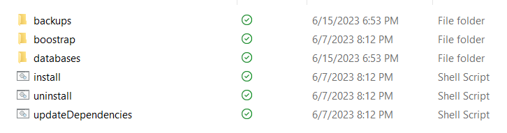

Posteriormente, puede ir a las carpetas **charts\databases** donde encontrará el archivo **values.yaml**, aquí podrá escoger la base de datos cambiando el valor de **enabled** a true

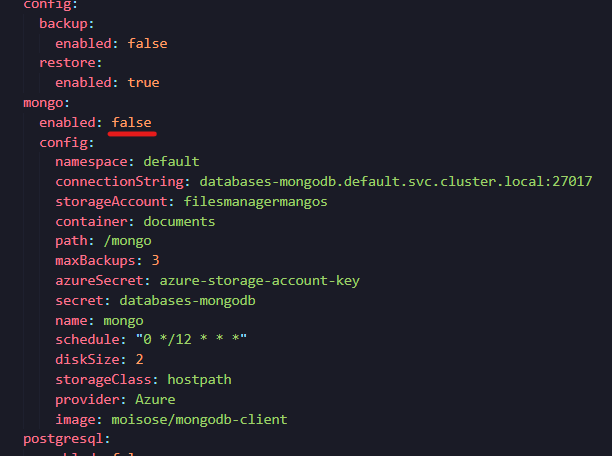

Posteriormente, debe ir a las carpetas **charts\backups** donde encontrará el archivo **values.yaml**, donde debe escoger la base de datos anteriormente escogida cambiando el valor de **enabled** a true

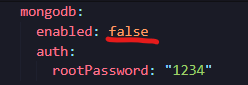

2- Ir a la carpeta **helm** con el comando **cd helm** o navegando hacia atrás on el comando **cd ..**

3- Ejecutar el comando **bash build.sh**, si da error al ejecutar, intente con el comando **dos2unix build.sh** y, posteriormente, ejecute de nuevo **bash build.sh**. Esperar a que se instalen los componentes.

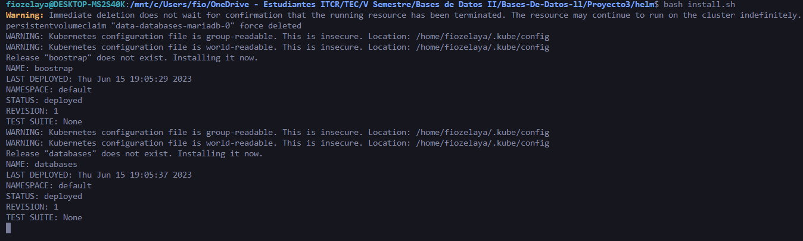

4- Ir a lens y observar el backup y restore de la base de datos.

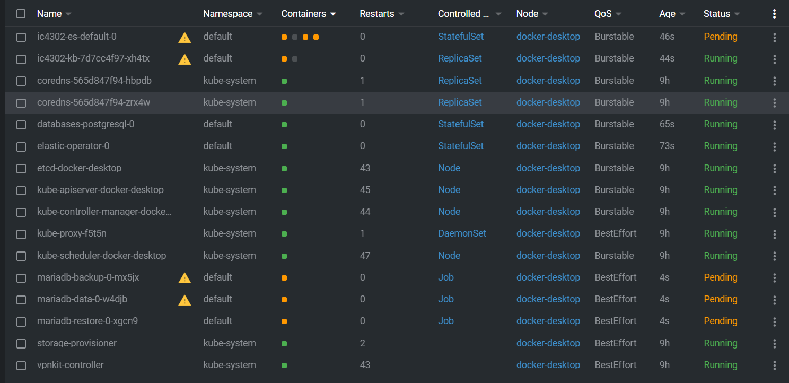

5- Ejecutar el comando **bash uninstall.sh** para desinstalar los componentes.

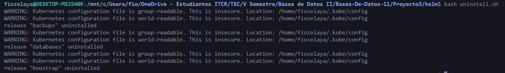 

# **Pruebas**

## **Pruebas de backups en Azure**

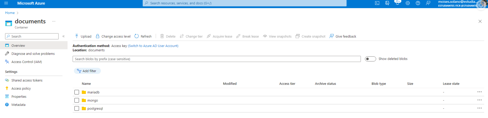

## **MongoDB**

### **Backup**

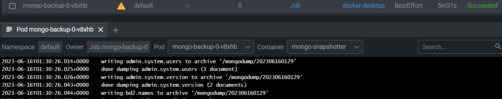

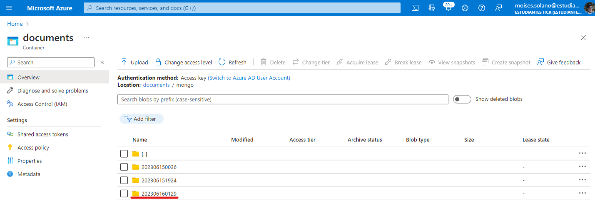

Para hacer un backup de MongoDB:

1. Ir al archivo **databases/values.yaml**

2. Cambiar config.backup.enabled a **true**

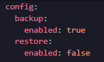

### **Restauración**

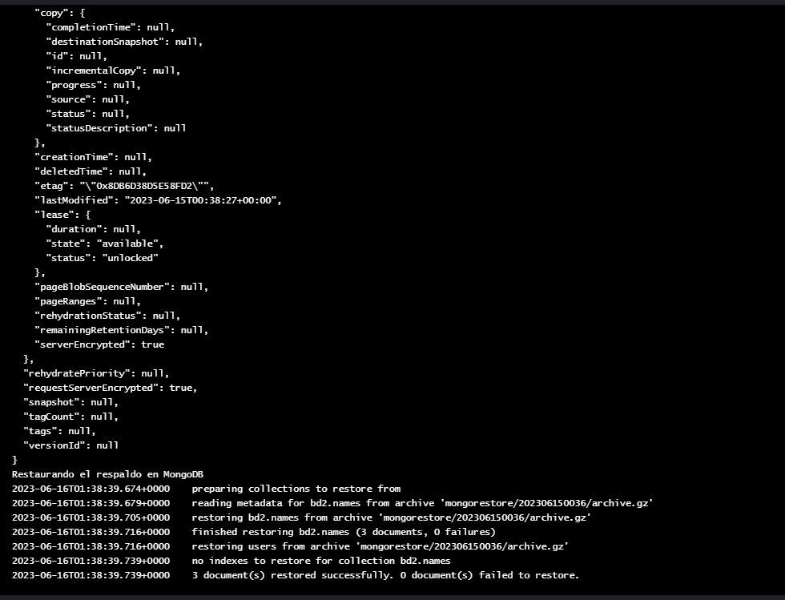

Para hacer una restauración de MongoDB:

1. Ir al archivo **databases/values.yaml**

2. Cambiar config.restore.enabled a **true**

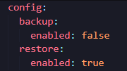

## **MariaDB**

### **Backup**

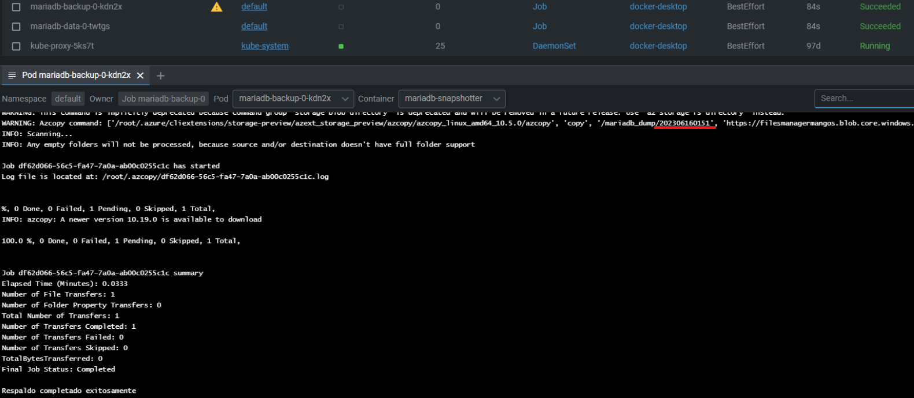

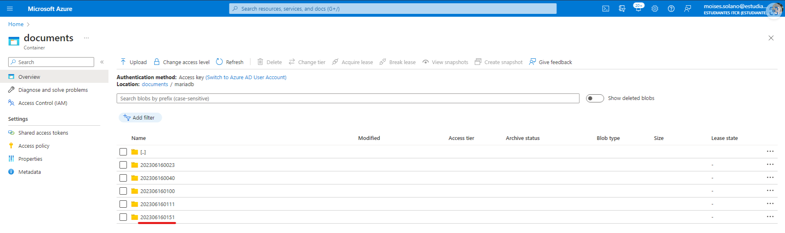

Para hacer un backup de MariaDB:

1. Ir al archivo **databases/values.yaml**

2. Cambiar config.backup.enabled a **true**

### **Restauración**

No se implementa la restauración de bases de datos para MariaDB.

## **PostgreSQL**

### **Backup**

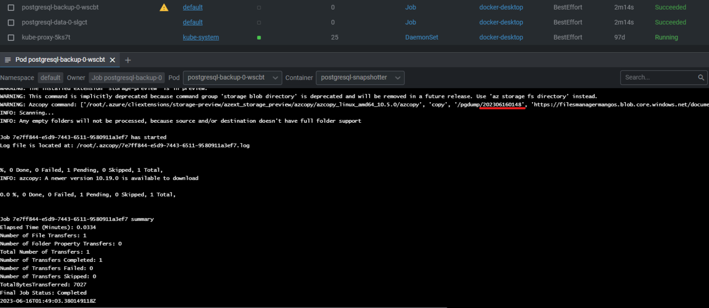

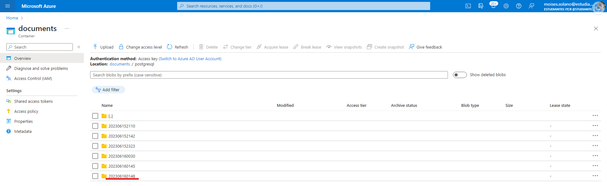

Para hacer un backup de PostgreSQL:

1. Ir al archivo **databases/values.yaml**

2. Cambiar config.backup.enabled a **true**

### **Restauración**

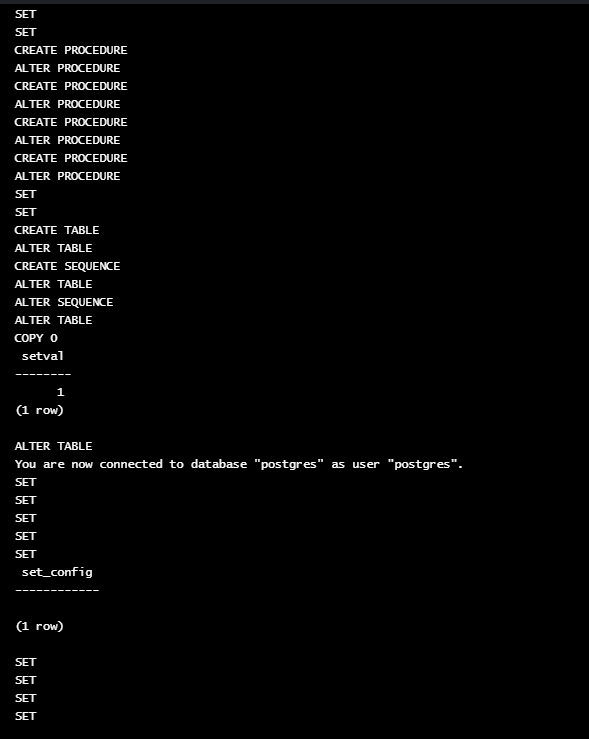

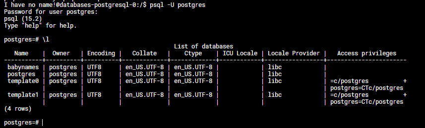

Para hacer una restauración de PostgreSQL:

1. Ir al archivo **databases/values.yaml**

2. Cambiar config.restore.enabled a **true**

## **ElasticSearch**

No se implementa el respaldo ni la restauración de base de datos para ElasticSearch.

## **Neo4j**

No se implementa el respaldo ni la restauración de base de datos para Neo4j.

## **CouchDB**

No se implementa el respaldo ni la restauración de base de datos para CouchDB.

# **Componentes**

Para cada una de las bases de datos, se agregan los valores necesarios en el archivo "values.yaml", de la carpeta templetes, en la sección de backups.

    

## **MongoDB**

Para el backup de MongoDB se utilizó el archivo "backup.yaml" en el que se realizan:

* ConfigMap: Se guardan aspectos de configuración, como el namespace y el script correspondiente.

    

* PersistentVolumeClaim: Se solicita el almacenamiento necesario y se define el modo de lectura-escritura.

    

* CronJob: Utilizado para automarizar los backups, tambien se definen variables de entorno y demás.

    

* Job: Se crea el pod para realizar la tarea del respaldo de MongoDB, tambien se definen variables de entorno y demás. Para realizar el restore del respaldo también se utiliza un Job.

    

Por otro lado, en este mismo archivo se definen un configmap y un job para hacer el cargado de la base de datos y los datos de prueba necesarios para comprobar el funcionamiento del backup.

    

### **Backup**

    

Para el script del backup de MongoDB se optiene la fecha, y se crea el directorio (en caso de que no exista), ademas, se hace un update de los paquetes y se importa **mongodb-tools**, este brinda las herramientas necesarias para manejar Mongo y poder hacer el dump.

Posteriormente se hace el **mongodump** a Mongo mediante el conection string, el username y el password.

Finalmente, se sube el dump al blobstorage de Azure.

### **Restauración**

    

Para el script de restauración tambien se crea un directorio, se hace un update de los paquetes y se importa **mongodb-tools**.

Posteriormente, se descarga el archivo desde el blob de azure, para que luego se pueda restaurar la base de datos con el comando correspondiente. En este caso se usa **mongodbrestore**.

## **MariaDB**

Para el backup de MariaDB se utilizó el archivo "backup_mariadb.yaml", en el que se realizan:

* ConfigMap: Se guardan aspectos de configuración, como el namespace y el script correspondiente.

    

* PersistentVolumeClaim: Se solicita el almacenamiento necesario y se define el modo de lectura-escritura.

    

* CronJob: Utilizado para automatizar los backups, tambien se definen variables de entorno y demás.

    

* Job: Se crea el pod para realizar la tarea del respaldo de MariaDB, tambien se definen variables de entorno y demás. Para la parte de la restauración, tambien se crea un job que se encarga de realizar la tarea de restaurar la base de datos.

    

Por otro lado, en este mismo archivo se definen un configmap y un job para hacer el cargado de la base de datos y los datos de prueba necesarios para comprobar el funcionamiento del backup.

    

### **Backup**

    

Para el script del backup de MariaDB se optiene la fecha, y se crea el directorio (en caso de que no exista), ademas, se hace un update de los paquetes y se importa **mariadb-client**, este brinda las herramientas necesarias para manejar MariaDB y poder hacer el dump.

Posteriormente se hace el **mysqldump** a la base de datos en MariaDB mendiante el username, el password y el host.

Finalmente, se sube el dump al blobstorage de Azure.

### **Restauración**

    

Para el script de restauración tambien se crea un directorio, se hace un update de los paquetes y se importa **mariadb-client y mysql-server**.

Posteriormente, se descarga el archivo desde el blob de azure, para que luego se pueda restaurar la base de datos con el comando correspondiente. En este caso el comando que se usa es **mariadbrestore**

## **PostgreSQL**

Para el backup de PostgreSQL se utilizó el archivo "backup_postgresql.yaml", en el que se realizan:

* ConfigMap: Se guardan aspectos de configuración, como el namespace y el script correspondiente.

    

* PersistentVolumeClaim: Se solicita el almacenamiento necesario y se define el modo de lectura-escritura.

    

* CronJob: Utilizado para automarizar los backups, tambien se definen variables de entorno y demás.

    

* Job: Se crea el pod para realizar la tarea del respaldo de PostgreSQL, tambien se definen variables de entorno y demás. Para la parte de la restauración, tambien se crea un job que se encarga de realizar la tarea de restaurar la base de datos.

    

Por otro lado, en este mismo archivo se definen un configmap y un job para hacer el cargado de la base de datos y los datos de prueba necesarios para comprobar el funcionamiento del backup.

    

### **Backup**

    

Para el script del backup de PostGreSQL se optiene la fecha, y se crea el directorio (en caso de que no exista), ademas, se hace un update de los paquetes y se importa **postgresql-client**, este brinda las herramientas necesarias para manejar postgresql y poder hacer el dump.

Posteriormente se hace el **pg_dump** a la base de datos en postgresql mendiante el username, el password y el host.

Finalmente, se sube el dump al blobstorage de Azure.

### **Restauración**

    

Para el script de restauración tambien se crea un directorio, se hace un update de los paquetes y se importa **postgresql-client**.

Posteriormente, se descarga el archivo desde el blob de azure, para que luego se pueda restaurar la base de datos con el comando correspondiente.

## **ElasticSearch**

No se implementa el respaldo ni la restauración de base de datos para ElasticSearch.

## **Neo4j**

No se implementa el respaldo ni la restauración de base de datos para Neo4j.

## **CouchDB**

No se implementa el respaldo ni la restauración de base de datos para CouchDB.

# **Conclusiones**

**1-** Es fundamental la comunicación para un buen desarrollo del proyecto.

**2-** Se debe mantener una buena organización para poder realizar el trabajo.

**3-** Es de gran importancia entender los conceptos básicos para realizar el proyecto.

**4-** El tener un buen control de versiones y la correcta utilización de github facilita el trabajo en equipo.

**5-** Se deben aplicar buenas prácticas de programación para mantener el orden.

**6-** Mantener la estructura definida del proyecto es esencial para evitar el desorden.

**7-** Se debe desarollar un código legible y entendible.

**8-** Se debe organizar el equipo de trabajo desde el día 1.

**9-** Se debe tener una estructura clara y ordenada del proyecto y lo que requiere.

**10-** Es importante que cada miembro del equipo entienda la tarea a realizar.

# **Recomendaciones**

**1-** Hacer reuniones periódicas para discutir los avances del proyecto y mejorar la comunicación.

**2-** Mantener la organización de la tarea.

**3-** Dividir el trabajo es importante, pero tambien es importante que cada persona del equipo entienda su tarea.

**4-** Hacer uso de github para el control de versiones y trabajo en conjunto.

**5-** Seguir un estándar de código.

**6-** Seguir aprendiendo y enriqueciendo el conocimiento después de finalizar el trabajo.

**7-** Investigar sobre las herramientas que se usan en el proyecto.

**8-** Tener una buena estructura del proyecto y dividir el proyecto de forma funcional para avanzar progresivamente.

**9-** Mantener la comunicación durante el desarrollo del proyecto y nunca quedarse con dudas.

**10-** Definir roles en el equipo de trabajo para mantener el orden y procurar buena dinámica de trabajo.

# **Referencias Bibliograficas**
