# Documentation

## **Instituto Tecnológico de Costa Rica**

## **IC4302 - Bases de Datos II**

## **Documentación Proyecto Opcional**

### **Profesor**: Nereo Campos Araya

### **Estudiantes**:

- Fiorella Zelaya Coto - 2021453615
- Isaac Araya Solano - 2018151703
- Melany Salas Fernández - 2021121147
- Moisés Solano Espinoza - 2021144322
- Pablo Arias Navarro - 2021024635

---

# **Guía de instalación y uso de la tarea**

1- Descomprimir el archivo .zip y abrir la linea de comandos wsl en la ubicación de la carpeta **tareaCorta1**

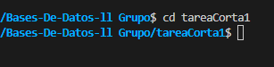

Posteriormente, puede ir a las carperpetas **charts\databases** donde encontrará el archivo **values.yaml**, aquí podrá escoger la base de datos a monitorear cambiando el valor de **enabled**

2- Ir a la carpeta **docker** con el comando **cd docker**

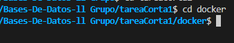

3- Ejecutar el comando **bash build.sh**, si da error al ejecutar, intente con el comando **dos2unix build.sh** y, posteriormente, ejecute de nuevo **bash build.sh**

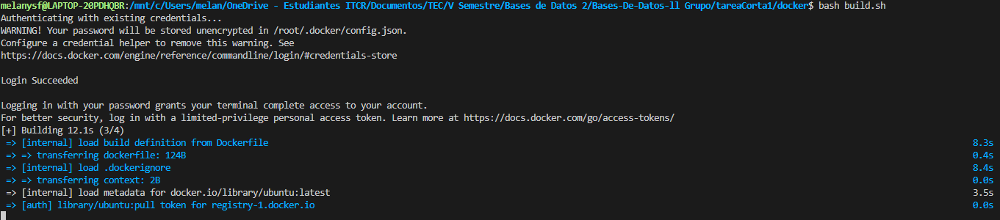

4- Ir a la carpeta **charts** con el comando **cd ../charts**

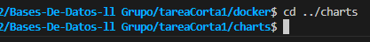

5- Ejecutar el comando **bash install.sh**, si da error al ejecutar, intente con el comando **dos2unix install.sh** y, posteriormente, ejecute de nuevo **bash install.sh**, ya con esto, debería ver los distintos pods en lens

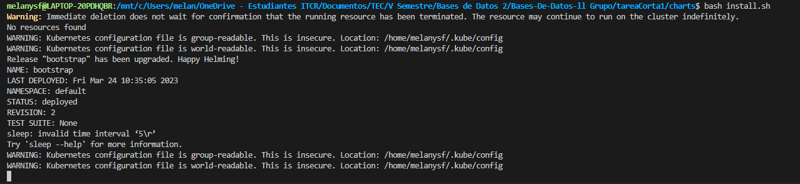 

6- Una vez instalado y cuando los pods estan arriba, abrir la carpeta **Gatling** e ir a **gatling-charts-highcharts-bundle-3.9.2/bin** y ejecutar **galing.bat**

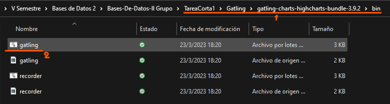

7- Esperar que abra la consola.

8- Una vez abierta, seleccionar la opción **[1]** presionando las teclas 1, seguido de enter.

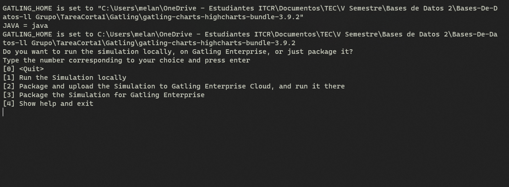

9- Aparecerá lo siguiente, debe presionar la tecla enter nuevamente pata que la prueba de carga comience.

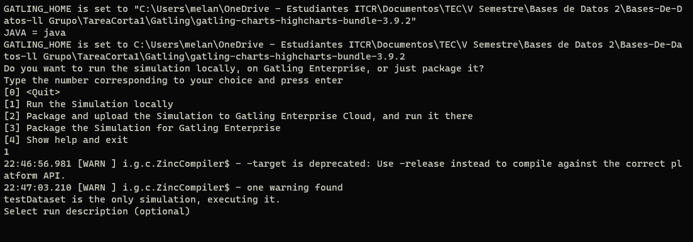

10- Puede entrar a la dirección que sale en consola para verificar la cantidad de usuarios que lograron conectarse con éxito.

11- Posteriormente, puede observar las métricas en **Grafana**, entrando a…

15- Para desinstalar, ejecute el comando **bash uninstall.sh**

# **Configuración de las herramientas**

## MariaDB

Para instalar el cliente de MariaDB se creó la imagen de MariaDB que incluye al cliente utilizando un Dockerfile. En nombre de esta imagen se guarda en el archivo ubicado en stateless/values.yaml que contiene otros valores de configuracion como el mapName, name y volumeName.

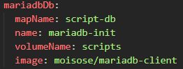

En charts/databases/values.yaml se tienen algunas configuraciones para la instancia de MariaDB, como datos necesarios para la autenticación, la cantidad de replicas que se necesitan, los nombres del nodo primario y nodos secundarios, el namespace y también podemos activar o deactivar la ejecución del pod de MariaDB. 

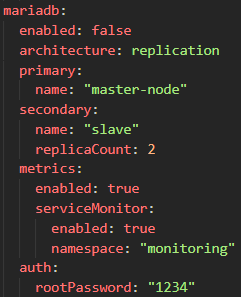

Para iniciar el cliente de MariaDB que permite acceder a la base de datos se utilizó un *Job*. En el archivo *mariadbDB.yaml* se define un ConfigMap y el Job. 

Dentro del Job se declaran las variables de entorno y se asigna el valor de cada una. Se declaran las variables de entorno para el *host, password y database*. También se utilizan los valores de las configuraciones que guardamos en stateless/values.yaml para asignar la imagen que le corresponde al Pod y asignar nombres a volúmenes u otros.

Asimismo, en este Job se indica el comando que se debe ejecutar en *args*, el cual se encarga de cargar el archivo sql *(babynames.sql)* que contiene las tablas y los procedimientos almacenados de la base de datos. 

 

## MariaDB Galera

Para instalar el cliente de MariaDB Galera se creó la imagen de MariaDB Galera que incluye al cliente utilizando un Dockerfile. En nombre de esta imagen se guarda en el archivo ubicado en stateless/values.yaml que contiene otros valores de configuracion como el mapName, name y volumeName.

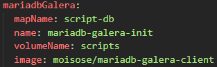

En charts/databases/values.yaml se tienen algunas configuraciones para la instancia de MariaDB Galera, como la cantidad de replicas que se requieren y los datos de autenticación (contraseña) para el usuario y la base de datos. También podemos activar o deactivar la ejecución del pod de MariaDB. 

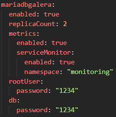

Para iniciar el cliente de MariaDB Galera que permite acceder a la base de datos se utilizó un *Job*. En el archivo *mariadbDBGalera.yaml* se define un ConfigMap y el Job. 

Dentro del Job se declaran las variables de entorno y se asigna el valor de cada una. Se declaran las variables de entorno para el *host y password*. También se utilizan los valores de las configuraciones que guardamos en stateless/values.yaml para asignar la imagen que le corresponde al Pod y asignar nombres a volúmenes u otros.

Asimismo, en este Job se indica el comando que se debe ejecutar en *args*, el cual se encarga de cargar el archivo sql *(babynames.sql)* que contiene las tablas y los procedimientos almacenados de la base de datos. 

 

## PostGreSQL

Para instalar el cliente de PostGreSQL se creó la imagen de PostGreSQL que incluye al cliente utilizando un Dockerfile. En nombre de esta imagen se guarda en el archivo ubicado en stateless/values.yaml que contiene otros valores de configuracion como el mapName, name y volumeName.

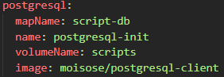

En charts/databases/values.yaml se tienen algunas configuraciones para la instancia de PostGreSQL, como datos necesarios para la autenticación (contraseña y nombre de base de datos), el namespace y también podemos activar o desactivar la ejecución del pod de PostGreSQL. 

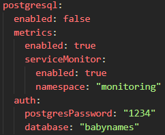

Para iniciar el cliente de PostGreSQL que permite acceder a la base de datos se utilizó un *Job*. En el archivo *postgresql.yaml* se define un ConfigMap y el Job. 

Dentro del Job se declaran las variables de entorno y se asigna el valor de cada una. Se declaran las variables de entorno para el *host y password*. También se utilizan los valores de las configuraciones que guardamos en stateless/values.yaml para asignar la imagen que le corresponde al Pod y asignar nombres a volúmenes u otros.

Asimismo, en este Job se indica el comando que se debe ejecutar en *args*, el cual se encarga de cargar el archivo sql *(postgres.sql)* que contiene las tablas y los procedimientos almacenados de la base de datos. 

 

## PostGreSQL High Availability

Para instalar el cliente de PostGreSQL High Availability se creó la misma imagen de PostGreSQL que incluye al cliente utilizando un Dockerfile. En nombre de esta imagen se guarda en el archivo ubicado en stateless/values.yaml que contiene otros valores de configuracion como el mapName, name y volumeName. Se utiliza la misma configuración de PostGreSQL.

En charts/databases/values.yaml se tienen algunas configuraciones para la instancia de PostGreSQL High Availability, como datos necesarios para la autenticación (contraseñas), el namespace y también podemos activar o desactivar la ejecución del pod de PostGreSQL. 

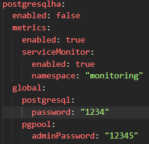

Para iniciar el cliente de PostGreSQL High Availability que permite acceder a la base de datos se utilizó un *Job*. En el archivo *postgresqlha.yaml* se define un ConfigMap y el Job. 

Dentro del Job se declaran las variables de entorno y se asigna el valor de cada una. Se declaran las variables de entorno para el *host y password*. También se utilizan los valores de las configuraciones que guardamos en stateless/values.yaml para asignar la imagen que le corresponde al Pod y asignar nombres a volúmenes u otros.

Asimismo, en este Job se indica el comando que se debe ejecutar en *args*, el cual se encarga de cargar el archivo sql *(postgres.sql)* que contiene las tablas y los procedimientos almacenados de la base de datos. 

## ElasticSearch

## MongoDB

 

## API con Flask

Para realizar las pruebas de carga se necesita usar Gatling, pero no todas las bases de datos tienen una interfaz para utilizar endpoints HTTP, por lo que se necesitó usar una aplicación intermediaria. 

Esta aplicación se desarrolló en Python utilizando la librería Flask. Cada base de datos utiliza un API distinto.

Para poder ejecutar un API de la base de datos se debe tener un Deployment corriendo en Kubernetes. Para lograr esto, se creó la imagen de cada API con un Dockerfile. El nombre de las imágenes se guarda en el archivo ubicado en stateless/values.yaml junto a otras configuraciones que servirán para configurar el Deployment, como name y nameApp. 

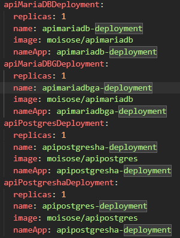

El Deployment de cada API se ubica en la carpeta charts/stateless/templates. Todos los Deployments siguen la misma estructura: Primero se define el servicio de tipo Deployment y luego un Servicio de NodePort para exponer el puerto y que se pueda comunicar el API con la base de datos. 

En el archivo yaml del Deployment de cada API se accede a los valores definidos en el archivo values.yaml para configurar el Deployment, como nombres de volúmenes o labels. También se definen las variables de entorno con sus valores.

El servicio NodePort de todos los Deployments están configurados en el port 5000, targetPort 5000, nodePort 3000 y porotocol TCP. Aquí también se accede a los valores definidos en el archivo values.yaml para configurar algunos aspectos como el nombre de la app del selector o labels.

# **Pruebas de carga realizadas**

Se realizo una prueba de carga con…

# **Conclusiones**

1- Es importante la comunicación entre el los miembros de grupo de trabajo.

2- Se debe mantener la organización para poder realizar la tarea.

3- Entender los conceptos vistos en clase ayuda en la realización de la tarea.

4- El tener un buen control de versiones y saber utilizar github facilita el trabajo en equipo.

5- Se deben aplicar buenas prácticas de programación para mantener el orden.

6- Mantener la estructura del proyecto es esencial

7- Se debe asegurar un código legible y entendible.

8- 

9-

10-

# **Recomendaciones**

1- Hacer reuniones periódicas para ver el avance de la tarea.

2- Mantener la organización de la tarea, según el ejemplo del profesor.

3- Repasar los conceptos vistos en clase y complementar con investigacion.

4- Aprender a hacer uso de github.

5- Seguir un estandar de código.

6- Seguir aprendiendo y enriqueciendo el conocimiento después de finalizar la tarea.

7- Investigar sobre herramientas esenciales para desarrollar la solución.

8- Tener una buena estructura del proyecto y dividir el proyecto de forma funcional.

9- Repartir y asignar tareas a cada integrante del equipo para progresar.

10-